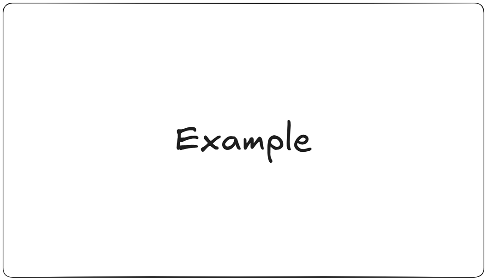

<h1 align="center"> Relational Databases and SQL </h1>

# Content

1. [Chapter 1: Introduction to Databases and SQL](#chapter1)
    - [Chapter 1 - Part 1: What is a Database and Why Use One?](#chapter1part1)
      - [Chapter 1 - Part 1.1: What is a Database?](#chapter1part1.1)
      - [Chapter 1 - Part 1.2: Why Use a Database?](#chapter1part1.2)
      - [Chapter 1 - Part 1.3: Real-World Applications](#chapter1part1.3)
    - [Chapter 1 - Part 2: Understanding Relational Databases and Tables](#chapter1part2)
      - [Chapter 1 - Part 2.1: Core Principles of Relational Databases](#chapter1part2.1)
      - [Chapter 1 - Part 2.2: Normalization](#chapter1part2.2)
      - [Chapter 1 - Part 2.3: Data Integrity](#chapter1part2.3)
      - [Chapter 1 - Part 2.4: The "Online Bookstore" Database](#chapter1part2.4)
    - [Chapter 1 - Part 3: Introduction to SQL: The Language of Databases](#chapter1part3)
      - [Chapter 1 - Part 3.1: Core Principles of Relational Databases](#chapter1part3.1)
      - [Chapter 1 - Part 3.2: What is SQL?](#chapter1part3.2)
      - [Chapter 1 - Part 3.3: SQL vs. Other Programming Languages](#chapter1part3.3)
      - [Chapter 1 - Part 3.4: SQL Statements and Syntax](#chapter1part3.4)
      - [Chapter 1 - Part 3.5: Data Types in SQL](#chapter1part3.5)
      - [Chapter 1 - Part 3.6: SQL Operators](#chapter1part3.6)
      - [Chapter 1 - Part 3.7: SQL Functions](#chapter1part3.7)
    - [Chapter 1 - Part 4: Setting Up Your SQL Environment (e.g., SQLite, MySQL)](#chapter1part4)
      - [Chapter 1 - Part 4.1: Choosing a Database Management System (DBMS)](#chapter1part4.1)
      - [Chapter 1 - Part 4.2: Setting Up SQLite](#chapter1part4.2)
      - [Chapter 1 - Part 4.3: Setting Up MySQL](#chapter1part4.3)
      - [Chapter 1 - Part 4.4: Connecting to a Database from a Programming Language](#chapter1part4.4)
    - [Chapter 1 - Part 5: Connecting to a Database and Running Basic Commands](#chapter1part5)
      - [Chapter 1 - Part 5.1: Establishing a Database Connection](#chapter1part5.1)
      - [Chapter 1 - Part 5.2: Running Basic SQL Commands](#chapter1part5.2)
    - [Chapter 1 - Part 6: Case Study Introduction: The "Online Bookstore" Database](#chapter1part6)
      - [Chapter 1 - Part 6.1: Introducing the Online Bookstore Database](#chapter1part6.1)
      - [Chapter 1 - Part 6.2: Detailed Table Schemas](#chapter1part6.2)
      - [Chapter 1 - Part 6.3: Example Scenarios and Queries](#chapter1part6.3)
2. [Chapter 2: Retriving Data with SELECT Statements](#chapter2)
    - [Chapter 2 - Part 1: Basic SELECT Statements: Choosing Columns](#chapter2part1)
      - [Chapter 2 - Part 1.1: Basic Syntax of the SELECT Statement](#chapter2part1.1)
      - [Chapter 2 - Part 1.2: Selecting Specific Columns](#chapter2part1.2)
      - [Chapter 2 - Part 1.3: Selecting All Columns Using the Asterisk (*) Wildcard](#chapter2part1.3)
      - [Chapter 2 - Part 1.4: Column Order in the SELECT Statement](#chapter2part1.4)
  

 Example - (<a href='https://github.com/vitorstabile'>Work by Vitor Garcia</a>) 

|               |                 |                 |                 |                 |                 |                 |                 |                 | 
| :-----------: | :-------------: | :-------------: | :-------------: | :-------------: | :-------------: | :-------------: | :-------------: | :-------------: |
|               |                 |                 |                 |                 |                 |                 |                 |                 |
|               |                 |                 |                 |                 |                 |                 |                 |                 |
|               |                 |                 |                 |                 |                 |                 |                 |                 |
|               |                 |                 |                 |                 |                 |                 |                 |                 |
  
## Chapter 1: Introduction to Databases and SQL

### Chapter 1 - Part 1: What is a Database and Why Use One?

#### Chapter 1 - Part 1.1: What is a Database?
