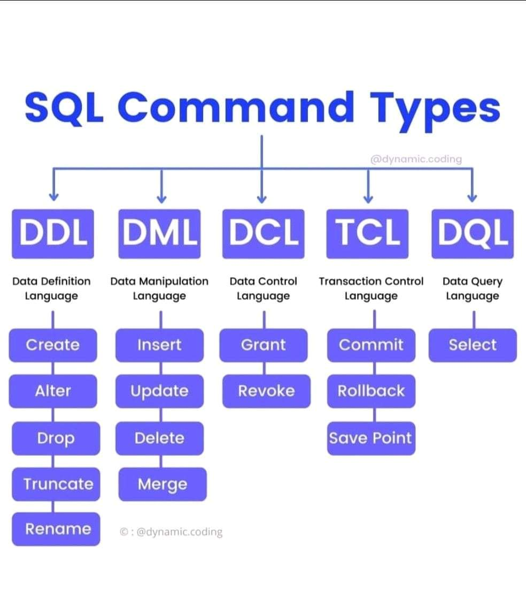

<h1 align="center"> Relational Databases and SQL </h1>

# Content

1. [Chapter 1: Introduction to Databases and SQL](#chapter1)
    - [Chapter 1 - Part 1: What is a Database and Why Use One?](#chapter1part1)
      - [Chapter 1 - Part 1.1: What is a Database?](#chapter1part1.1)
      - [Chapter 1 - Part 1.2: Why Use a Database?](#chapter1part1.2)
      - [Chapter 1 - Part 1.3: Real-World Applications](#chapter1part1.3)
    - [Chapter 1 - Part 2: Understanding Relational Databases and Tables](#chapter1part2)
      - [Chapter 1 - Part 2.1: Core Principles of Relational Databases](#chapter1part2.1)
      - [Chapter 1 - Part 2.2: Normalization](#chapter1part2.2)
      - [Chapter 1 - Part 2.3: Data Integrity](#chapter1part2.3)
      - [Chapter 1 - Part 2.4: The "Online Bookstore" Database](#chapter1part2.4)
    - [Chapter 1 - Part 3: Introduction to SQL: The Language of Databases](#chapter1part3)
      - [Chapter 1 - Part 3.1: What is SQL?](#chapter1part3.1)
      - [Chapter 1 - Part 3.2: SQL vs. Other Programming Languages](#chapter1part3.2)
      - [Chapter 1 - Part 3.3: SQL Statements and Syntax](#chapter1part3.3)
      - [Chapter 1 - Part 3.4: Data Types in SQL](#chapter1part3.4)
      - [Chapter 1 - Part 3.5: SQL Operators](#chapter1part3.5)
      - [Chapter 1 - Part 3.6: SQL Functions](#chapter1part3.6)
      - [Chapter 1 - Part 3.8: Different categories of SQL commands: DDL, DML, DCL, TCL, and DQL](#chapter1part3.8)
    - [Chapter 1 - Part 4: Setting Up Your SQL Environment (e.g., SQLite, MySQL, PostgreSQL)](#chapter1part4)
      - [Chapter 1 - Part 4.1: Choosing a Database Management System (DBMS)](#chapter1part4.1)
      - [Chapter 1 - Part 4.2: Setting Up SQLite](#chapter1part4.2)
      - [Chapter 1 - Part 4.3: Setting Up MySQL](#chapter1part4.3)
      - [Chapter 1 - Part 4.4: Setting Up PostgreSQL](#chapter1part4.4)
      - [Chapter 1 - Part 4.5: Setting Up DuckDB](#chapter1part4.5)
      - [Chapter 1 - Part 4.6: Connecting to a Database from a Programming Language](#chapter1part4.6)
    - [Chapter 1 - Part 5: Connecting to a Database and Running Basic Commands](#chapter1part5)
      - [Chapter 1 - Part 5.1: Establishing a Database Connection](#chapter1part5.1)
    - [Chapter 1 - Part 6: Case Study Introduction: The "Online Bookstore" Database](#chapter1part6)
      - [Chapter 1 - Part 6.1: Introducing the Online Bookstore Database](#chapter1part6.1)
      - [Chapter 1 - Part 6.2: Detailed Table Schemas](#chapter1part6.2)
      - [Chapter 1 - Part 6.3: Example Scenarios and Queries](#chapter1part6.3)
2. [Chapter 2: Retriving Data with SELECT Statements](#chapter2)
    - [Chapter 2 - Part 1: Basic SELECT Statements: Choosing Columns](#chapter2part1)
      - [Chapter 2 - Part 1.1: Basic Syntax of the SELECT Statement](#chapter2part1.1)
      - [Chapter 2 - Part 1.2: Selecting Specific Columns](#chapter2part1.2)
      - [Chapter 2 - Part 1.3: Selecting All Columns Using the Asterisk (*) Wildcard](#chapter2part1.3)
      - [Chapter 2 - Part 1.4: Column Order in the SELECT Statement](#chapter2part1.4)
      - [Chapter 2 - Part 1.5: Retrieve only the unique values](#chapter2part1.5)
    - [Chapter 2 - Part 2: Filtering Data with WHERE Clauses: Conditions and Operators](#chapter2part2)
      - [Chapter 2 - Part 2.1: Understanding the WHERE Clause](#chapter2part2.1)
      - [Chapter 2 - Part 2.2: Comparison Operators](#chapter2part2.2)
      - [Chapter 2 - Part 2.3: Logical Operators](#chapter2part2.3)
      - [Chapter 2 - Part 2.4: Special Operators](#chapter2part2.4)
      - [Chapter 2 - Part 2.5: Operator Precedence](#chapter2part2.5)
      - [Chapter 2 - Part 2.6: Case Sensitivity](#chapter2part2.6)
      - [Chapter 2 - Part 2.7: Case() Functions](#chapter2part2.7)
      - [Chapter 2 - Part 2.8: Performance Considerations](#chapter2part2.8)
    - [Chapter 2 - Part 3: Sorting Data with ORDER BY: Ascending and Descending](#chapter2part3)
      - [Chapter 2 - Part 3.1: Understanding the ORDER BY Clause](#chapter2part3.1)
      - [Chapter 2 - Part 3.2: Practical Examples and Demonstrations](#chapter2part3.2)
    - [Chapter 2 - Part 4: Limiting Results with LIMIT: Retrieving Top N Rows](#chapter2part4)
      - [Chapter 2 - Part 4.1: Understanding the LIMIT Clause](#chapter2part4.1)
    - [Chapter 2 - Part 5: Using Aliases for Columns and Tables: Improving Readability](#chapter2part5)
      - [Chapter 2 - Part 5.1: Understanding Aliases](#chapter2part5.1)
      - [Chapter 2 - Part 5.2: Practical Examples and Demonstrations](#chapter2part5.2)
    - [Chapter 2 - Part 6: Practical Exercise: Querying the Bookstore Database](#chapter2part6)
      - [Chapter 2 - Part 6.1: Bookstore Database Schema](#chapter2part6.1)
      - [Chapter 2 - Part 6.2: Practical Exercises](#chapter2part6.2)
3. [Chapter 3: Working with Multiple Tables: Join](#chapter3)
    - [Chapter 3 - Part 1: Understanding Primary and Foreign Keys](#chapter3part1)
      - [Chapter 3 - Part 1.1: Understanding Primary Keys](#chapter3part1.1)
      - [Chapter 3 - Part 1.2: Understanding Foreign Keys](#chapter3part1.2)
      - [Chapter 3 - Part 1.3: Practical Examples and Demonstrations](#chapter3part1.3)
    - [Chapter 3 - Part 2: Introduction to JOINs: Combining Data from Multiple Tables](#chapter3part2)
      - [Chapter 3 - Part 2.1: Understanding Primary and Foreign Keys](#chapter3part2.1)
      - [Chapter 3 - Part 2.2: Introduction to JOINs: Combining Data from Multiple Tables](#chapter3part2.2)
      - [Chapter 3 - Part 2.3: Practical Examples and Demonstrations](#chapter3part2.3)
    - [Chapter 3 - Part 3: INNER JOIN: Retrieving Matching Rows](#chapter3part3)
      - [Chapter 3 - Part 3.1: Understanding INNER JOIN](#chapter3part3.1)
      - [Chapter 3 - Part 3.2: Practical Examples and Demonstrations](#chapter3part3.2)
    - [Chapter 3 - Part 4: LEFT JOIN (LEFT OUTER JOIN): Retrieving All Rows from the Left Table](#chapter3part4)
      - [Chapter 3 - Part 4.1: Understanding the LEFT JOIN](#chapter3part4.1)
      - [Chapter 3 - Part 4.2: Practical Examples Using the Bookstore Database](#chapter3part4.2)
    - [Chapter 3 - Part 5: RIGHT JOIN (RIGHT OUTER JOIN): Retrieving All Rows from the Right Table](#chapter3part5)
      - [Chapter 3 - Part 5.1: Understanding the RIGHT JOIN](#chapter3part5.1)
      - [Chapter 3 - Part 5.2: Practical Examples](#chapter3part5.2)
    - [Chapter 3 - Part 6: FULL OUTER JOIN: Retrieving All Rows from Both Tables](#chapter3part6)
      - [Chapter 3 - Part 6.1: Understanding FULL OUTER JOIN](#chapter3part6.1)
      - [Chapter 3 - Part 6.2: Practical Examples](#chapter3part6.2)
      - [Chapter 3 - Part 6.3: Real-World Application](#chapter3part6.3)
    - [Chapter 3 - Part 7: Practical Exercise: Joining Tables in the Bookstore Database](#chapter3part7)
      - [Chapter 3 - Part 7.1: Setting Up the Bookstore Database (Reminder)](#chapter3part7.1)
      - [Chapter 3 - Part 7.2: Exercise 1: Retrieving Book Titles and Author Names](#chapter3part7.2)
      - [Chapter 3 - Part 7.3: Exercise 2: Finding Customers and Their Orders](#chapter3part7.3)
      - [Chapter 3 - Part 7.4: Exercise 3: Retrieving Book Titles and Order Information](#chapter3part7.4)
      - [Chapter 3 - Part 7.5: Exercise 4: Using LEFT JOIN to Find Authors Without Books](#chapter3part7.5)
      - [Chapter 3 - Part 7.6: Exercise 5: Combining Different JOIN Types](#chapter3part7.6)
4. [Chapter 4: Data Manipulation: INSERT; UPDATE, and DELETE](#chapter4)
    - [Chapter 4 - Part 1: Inserting New Data with INSERT INTO](#chapter4part1)
      - [Chapter 4 - Part 1.1: Basic INSERT INTO Syntax](#chapter4part1.1)
      - [Chapter 4 - Part 1.2: Inserting Data into Specific Columns](#chapter4part1.2)
      - [Chapter 4 - Part 1.3: Inserting Multiple Rows](#chapter4part1.3)
      - [Chapter 4 - Part 1.4: Inserting Data from Another Table](#chapter4part1.4)
      - [Chapter 4 - Part 1.5: Data Type Considerations](#chapter4part1.5)
      - [Chapter 4 - Part 1.6: Handling Errors and Constraints](#chapter4part1.6)
      - [Chapter 4 - Part 1.7: Best Practices for INSERT INTO Statements](#chapter4part1.7)
    - [Chapter 4 - Part 2: Updating Existing Data with UPDATE](#chapter4part2)
      - [Chapter 4 - Part 2.1: The Basic Syntax of UPDATE](#chapter4part2.1)
      - [Chapter 4 - Part 2.2: Understanding the WHERE Clause](#chapter4part2.2)
      - [Chapter 4 - Part 2.3: Updating with Values from Another Table (Advanced)](#chapter4part2.3)
      - [Chapter 4 - Part 2.4: Important Considerations and Best Practices](#chapter4part2.4)
    - [Chapter 4 - Part 3: Deleting Data with DELETE FROM](#chapter4part3)
      - [Chapter 4 - Part 3.1: The DELETE FROM Statement: Basic Syntax](#chapter4part3.1)
      - [Chapter 4 - Part 3.2: Using the WHERE Clause Effectively](#chapter4part3.2)
      - [Chapter 4 - Part 3.3: The Importance of WHERE and the Dangers of Accidental Deletion](#chapter4part3.3)
    - [Chapter 4 - Part 4: Understanding Transactions: Ensuring Data Integrity](#chapter4part4)
      - [Chapter 4 - Part 4.1: Understanding the ACID Properties](#chapter4part4.1)
      - [Chapter 4 - Part 4.2: Managing Transactions in SQL](#chapter4part4.2)
      - [Chapter 4 - Part 4.3: Implicit vs. Explicit Transactions](#chapter4part4.3)
      - [Chapter 4 - Part 4.4: Savepoints: Rolling Back to a Specific Point](#chapter4part4.4)
      - [Chapter 4 - Part 4.5: Concurrency Control and Isolation Levels](#chapter4part4.5)
      - [Chapter 4 - Part 4.6: Practical Exercise: Implementing a Book Purchase Transaction](#chapter4part4.6)
      - [Chapter 4 - Part 4.7: Real-World Applications](#chapter4part4.7)
    - [Chapter 4 - Part 5: Practical Exercise: Modifying Data in the Bookstore Database](#chapter4part5)
      - [Chapter 4 - Part 5.1: Inserting New Data with INSERT INTO](#chapter4part5.1)
      - [Chapter 4 - Part 5.2: Updating Existing Data with UPDATE](#chapter4part5.2)
      - [Chapter 4 - Part 5.3: Deleting Data with DELETE FROM](#chapter4part5.3)
      - [Chapter 4 - Part 5.4: Understanding Transactions: Ensuring Data Integrity](#chapter4part5.4)
      - [Chapter 4 - Part 5.5: Importance of Backups and Data Recovery](#chapter4part5.5)
    - [Chapter 4 - Part 6: Importance of Backups and Data Recovery](#chapter4part6)
      - [Chapter 4 - Part 6.1: Why Backups are Essential](#chapter4part6.1)
      - [Chapter 4 - Part 6.2: Types of Backups](#chapter4part6.2)
      - [Chapter 4 - Part 6.3: Backup Strategies](#chapter4part6.3)
      - [Chapter 4 - Part 6.4: Data Recovery Process](#chapter4part6.4)
      - [Chapter 4 - Part 6.5: Testing Your Backups](#chapter4part6.5)
      - [Chapter 4 - Part 6.6: Real-World Application](#chapter4part6.6)
5. [Chapter 5: Aggregate Functions and Grouping](#chapter5)
    - [Chapter 5 - Part 1: Introduction to Aggregate Functions: COUNT, SUM, AVG, MIN, MAX](#chapter5part1)
      - [Chapter 5 - Part 1.1: Understanding Aggregate Functions](#chapter5part1.1)
      - [Chapter 5 - Part 1.2: COUNT() Function](#chapter5part1.2)
      - [Chapter 5 - Part 1.3: SUM() Function](#chapter5part1.3)
      - [Chapter 5 - Part 1.4: AVG() Function](#chapter5part1.4)
      - [Chapter 5 - Part 1.5: MIN() and MAX() Functions](#chapter5part1.5)
      - [Chapter 5 - Part 1.6: Combining Aggregate Functions](#chapter5part1.6)
      - [Chapter 5 - Part 1.7: Real-World Application](#chapter5part1.7)
    - [Chapter 5 - Part 2: Grouping Data with GROUP BY: Analyzing Data Subsets](#chapter5part2)
      - [Chapter 5 - Part 2.1: Understanding the GROUP BY Clause](#chapter5part2.1)
      - [Chapter 5 - Part 2.2: Practical Examples Using the Bookstore Database](#chapter5part2.2)
    - [Chapter 5 - Part 3: Filtering Groups with HAVING: Applying Conditions to Aggregated Data](#chapter5part3)
      - [Chapter 5 - Part 3.1: Understanding the HAVING Clause](#chapter5part3.1)
      - [Chapter 5 - Part 3.2: Practical Examples Using the Bookstore Database](#chapter5part3.2)
      - [Chapter 5 - Part 3.3: Real-World Application](#chapter5part3.3)
    - [Chapter 5 - Part 4: Combining Aggregate Functions and Joins](#chapter5part4)
      - [Chapter 5 - Part 4.1: Understanding the Synergy of Aggregate Functions and Joins](#chapter5part4.1)
      - [Chapter 5 - Part 4.2: Practical Examples in the Bookstore Database](#chapter5part4.2)
      - [Chapter 5 - Part 4.3: Filtering Groups with HAVING](#chapter5part4.3)
    - [Chapter 5 - Part 5: Practical Exercise: Analyzing Sales Data in the Bookstore Database](#chapter5part5)
      - [Chapter 5 - Part 5.1: Introduction to Aggregate Functions](#chapter5part5.1)
      - [Chapter 5 - Part 5.2: Grouping Data with GROUP BY](#chapter5part5.2)
      - [Chapter 5 - Part 5.3: Filtering Groups with HAVING](#chapter5part5.3)
      - [Chapter 5 - Part 5.4: Combining Aggregate Functions and Joins](#chapter5part5.4)
    - [Chapter 5 - Part 6: Common SQL Errors and Troubleshooting](#chapter5part6)
      - [Chapter 5 - Part 6.1: Common SQL Error Types](#chapter5part6.1)
      - [Chapter 5 - Part 6.2: Troubleshooting Techniques](#chapter5part6.2)
      - [Chapter 5 - Part 6.3: Practical Examples and Demonstrations](#chapter5part6.3)
6. [Chapter 6: Scalar Functions](#chapter6)
7. [Chapter 7: Case manipulation Functions](#chapter7)
8. [Chapter 8: Character manipulation Functions](#chapter8)
9. [Chapter 9: Case() Functions](#chapter9)
10. [Chapter 10: Set Operators](#chapter10)
11. [Chapter 11: Subqueries and Views](#chapter11)
    - [Chapter 11 - Part 1: Introduction to Subqueries: Queries Within Queries](#chapter11part1)
      - [Chapter 11 - Part 1.1: Understanding Subqueries](#chapter11part1.1)
      - [Chapter 11 - Part 1.2: Using Subqueries in WHERE Clauses](#chapter11part1.2)
      - [Chapter 11 - Part 1.3: Using Subqueries in SELECT Clauses](#chapter11part1.3)
      - [Chapter 11 - Part 1.4: Table Subqueries in the FROM Clause](#chapter11part1.4)
      - [Chapter 11 - Part 1.5: Table Subqueries in the HAVING Clause](#chapter11part1.5)
    - [Chapter 11 - Part 2: Using Subqueries in WHERE Clauses](#chapter11part2)
      - [Chapter 11 - Part 2.1: Understanding Subqueries in WHERE Clauses](#chapter11part2.1)
      - [Chapter 11 - Part 2.2: Single-Row Subqueries](#chapter11part2.2)
      - [Chapter 11 - Part 2.3: Multiple-Row Subqueries](#chapter11part2.3)
      - [Chapter 11 - Part 2.4: Correlated Subqueries](#chapter11part2.4)
    - [Chapter 11 - Part 3: Using Subqueries in SELECT Clauses](#chapter11part3)
      - [Chapter 11 - Part 3.1: Understanding Subqueries in the SELECT Clause](#chapter11part3.1)
      - [Chapter 11 - Part 3.2: Uncorrelated Subqueries in the SELECT Clause](#chapter11part3.2)
      - [Chapter 11 - Part 3.3: Correlated Subqueries in the SELECT Clause](#chapter11part3.3)
      - [Chapter 11 - Part 3.4: Practical Considerations and Best Practices](#chapter11part3.4)
    - [Chapter 11 - Part 4: Creating Views: Virtual Tables for Simplified Queries](#chapter11part4)
      - [Chapter 11 - Part 4.1: Understanding Views](#chapter11part4.1)
      - [Chapter 11 - Part 4.2: Creating Simple Views](#chapter11part4.2)
      - [Chapter 11 - Part 4.3: Creating Complex Views](#chapter11part4.3)
      - [Chapter 11 - Part 4.4: Advantages and Disadvantages of Using Views](#chapter11part4.4)
      - [Chapter 11 - Part 4.5: Updatable Views](#chapter11part4.5)
      - [Chapter 11 - Part 4.6: Dropping Views](#chapter11part4.6)
    - [Chapter 11 - Part 5: Advantages and Disadvantages of Using Views](#chapter11part5)
      - [Chapter 11 - Part 5.1: Advantages of Using Views](#chapter11part5.1)
      - [Chapter 11 - Part 5.2: Disadvantages of Using Views](#chapter11part5.2)
      - [Chapter 11 - Part 5.3: Practical Examples and Demonstrations](#chapter11part5.3)
    - [Chapter 11 - Part 6: Practical Exercise: Creating and Using Views in the Bookstore Database](#chapter11part6)
      - [Chapter 11 - Part 6.1: Creating Views](#chapter11part6.1)
      - [Chapter 11 - Part 6.2: Using Views](#chapter11part6.2)
      - [Chapter 11 - Part 6.3: Advantages and Disadvantages of Using Views](#chapter11part6.3)
12. [Chapter 12: CTE (Common Table Expression)](#chapter12)
13. [Chapter 13: Advanced SQL Concepts and Best Practices](#chapter13)
    - [Chapter 13 - Part 1: Introduction to Indexes: Improving Query Performance](#chapter13part1)
      - [Chapter 13 - Part 1.1: Understanding Indexes](#chapter13part1.1)
      - [Chapter 13 - Part 1.2: Types of Indexes](#chapter13part1.2)
      - [Chapter 13 - Part 1.3: Indexing Strategies](#chapter13part1.3)
      - [Chapter 13 - Part 1.4: Practical Examples and Demonstrations](#chapter13part1.4)
    - [Chapter 13 - Part 2: Understanding Different Types of Indexes](#chapter13part2)
      - [Chapter 13 - Part 2.1: Understanding Index Basics](#chapter13part2.1)
      - [Chapter 13 - Part 2.2: Types of Indexes](#chapter13part2.2)
      - [Chapter 13 - Part 2.3: Choosing the Right Index](#chapter13part2.3)
      - [Chapter 13 - Part 2.4: Indexing Strategies for the Bookstore Database](#chapter13part2.4)
    - [Chapter 13 - Part 3: Using EXPLAIN to Analyze Query Performance](#chapter13part3)
      - [Chapter 13 - Part 3.1: Introduction to EXPLAIN](#chapter13part3.1)
      - [Chapter 13 - Part 3.2: Interpreting EXPLAIN Output](#chapter13part3.2)
      - [Chapter 13 - Part 3.3: Optimizing Queries Based on EXPLAIN Output](#chapter13part3.3)
    - [Chapter 13 - Part 4: SQL Injection Prevention: Writing Secure Queries](#chapter13part4)
      - [Chapter 13 - Part 4.1: Understanding SQL Injection](#chapter13part4.1)
      - [Chapter 13 - Part 4.2: Preventing SQL Injection: Secure Coding Practices](#chapter13part4.2)
    - [Chapter 13 - Part 5: Introduction to Stored Procedures and Functions](#chapter13part5)
      - [Chapter 13 - Part 5.1: Understanding Stored Procedures](#chapter13part5.1)
      - [Chapter 13 - Part 5.2: Understanding Functions](#chapter13part5.2)
      - [Chapter 13 - Part 5.3: Real-World Applications](#chapter13part5.3)
    - [Chapter 13 - Part 6: Best Practices for Writing Clean and Efficient SQL Code](#chapter13part6)
      - [Chapter 13 - Part 6.1: Importance of Code Readability](#chapter13part6.1)
      - [Chapter 13 - Part 6.2: Writing Efficient SQL Queries](#chapter13part6.2)
    - [Chapter 13 - Part 7: Next Steps: Further Learning and Resources](#chapter13part7)
      - [Chapter 13 - Part 7.1: Delving Deeper: Advanced SQL Topics](#chapter13part7.1)
      - [Chapter 13 - Part 7.2: Online Resources and Communities](#chapter13part7.2)
      - [Chapter 13 - Part 7.3: Practical Projects and Exercises](#chapter13part7.3)
      - [Chapter 13 - Part 7.4: Best Practices for Continuous Learning](#chapter13part7.4)

     
<div align="center"><br><sub>Example - (<a href='https://github.com/vitorstabile'>Work by Vitor Garcia</a>) </sub></div>

|               |                 |                 |                 |                 |                 |                 |                 |                 | 
| :-----------: | :-------------: | :-------------: | :-------------: | :-------------: | :-------------: | :-------------: | :-------------: | :-------------: |
|               |                 |                 |                 |                 |                 |                 |                 |                 |
|               |                 |                 |                 |                 |                 |                 |                 |                 |
|               |                 |                 |                 |                 |                 |                 |                 |                 |
|               |                 |                 |                 |                 |                 |                 |                 |                 |
  
## <a name="chapter1"></a>Chapter 1: Introduction to Databases and SQL

#### <a name="chapter1part1"></a>Chapter 1 - Part 1: What is a Database and Why Use One?

Databases are the backbone of modern data management, enabling efficient storage, retrieval, and manipulation of information. Understanding what a database is and why we use one is fundamental to working with data in any field. This lesson will explore the core concepts of databases, their advantages, and real-world applications, setting the stage for your journey into the world of SQL.

#### <a name="chapter1part1.1"></a>Chapter 1 - Part 1.1: What is a Database?

At its core, a database is an organized collection of structured information, or data, typically stored electronically in a computer system. Databases are designed to allow efficient storage, retrieval, modification, and deletion of data, along with various data management operations. Think of it as a highly organized digital filing cabinet, far more powerful and efficient than a physical one.

**Key Characteristics of a Database**


- **Structured Data:** Data within a database is organized in a predefined format, making it easier to search, sort, and analyze. This structure is typically defined by a schema, which specifies the types of data that can be stored and the relationships between different pieces of data.

- **Persistence:** Data in a database is persistent, meaning it remains stored even when the system is powered off. This ensures that information is not lost and can be accessed whenever needed.

- **Organization:** Databases provide mechanisms for organizing data logically, such as tables, indexes, and views. This organization allows for efficient retrieval of specific data elements.

- **Data Integrity:** Databases enforce rules and constraints to ensure the accuracy and consistency of data. This includes data type validation, uniqueness constraints, and referential integrity.

- **Accessibility:** Databases provide controlled access to data, allowing authorized users and applications to retrieve and modify information while protecting it from unauthorized access.

- **Scalability:** Databases are designed to handle large volumes of data and can be scaled to accommodate growing data needs.

**Database Management Systems (DBMS)**

A Database Management System (DBMS) is the software that interacts with end-users, applications, and the database itself to capture and analyze the data. The DBMS provides the tools necessary to create, manage, and use databases. Popular DBMS examples include MySQL, PostgreSQL, Oracle, Microsoft SQL Server, and SQLite. We will be using SQLite in this course due to its ease of setup and use.

#### <a name="chapter1part1.2"></a>Chapter 1 - Part 1.2: Why Use a Database?

Databases offer numerous advantages over other methods of data storage, such as spreadsheets or simple text files. These advantages make them essential for managing data in modern applications.

**Data Integrity and Consistency**

Databases enforce rules and constraints to ensure data integrity and consistency. This means that the data stored in the database is accurate, reliable, and consistent across all applications and users.

- **Example:** In an online bookstore database, a constraint could be set to ensure that the price of a book is always a positive number. If someone tries to enter a negative price, the database will reject the entry, preventing incorrect data from being stored. Another constraint could ensure that each book has a unique ISBN.

**Data Security**

Databases provide robust security features to protect data from unauthorized access and modification. This includes user authentication, access control, and encryption.

- **Example:** In the online bookstore database, different users can be granted different levels of access. Administrators might have full access to all data, while customers might only be able to access their own order history and account information. Sensitive data, such as credit card numbers, can be encrypted to protect it from being intercepted.

**Data Sharing and Collaboration**

Databases allow multiple users and applications to access and share data simultaneously. This facilitates collaboration and ensures that everyone is working with the same, up-to-date information.

- **Example:** In the online bookstore, multiple employees can access the database at the same time to process orders, update inventory, and manage customer accounts. The database ensures that all changes are synchronized, so everyone sees the most current information.

**Data Redundancy Reduction**

Databases minimize data redundancy by storing data in a structured and organized manner. This reduces storage space and improves data consistency.

- **Example:** Instead of storing customer information multiple times in different tables (e.g., orders, shipping addresses, billing addresses), the customer information is stored once in a dedicated customer table. Other tables then reference this customer table using a unique identifier (customer ID), avoiding duplication of data.

**Efficient Data Retrieval**

Databases provide efficient mechanisms for retrieving data, such as indexing and query optimization. This allows users to quickly find the information they need, even in large datasets.

- **Example:** In the online bookstore, an index can be created on the ```book_title``` column of the ```books``` table. This allows the database to quickly find all books with a specific title, without having to scan the entire table. We will learn more about indexes in Module 7.

**Data Analysis and Reporting**

Databases provide tools for analyzing data and generating reports. This allows users to gain insights from their data and make informed decisions.

- **Example:** The online bookstore can use the database to generate reports on sales trends, popular book categories, and customer demographics. This information can be used to optimize marketing campaigns, improve inventory management, and personalize the customer experience.

#### <a name="chapter1part1.3"></a>Chapter 1 - Part 1.3: Real-World Applications

Databases are used in a wide variety of applications across many industries. Here are a few examples:

- **E-commerce:** Online stores use databases to store product information, customer data, order history, and payment details.

- **Banking:** Banks use databases to manage customer accounts, track transactions, and process loans.

- **Healthcare:** Hospitals use databases to store patient records, manage appointments, and track medical treatments.

- **Social Media:** Social media platforms use databases to store user profiles, posts, comments, and connections.

- **Education:** Universities use databases to manage student records, course information, and grades.

**Hypothetical Scenario: A Local Library**

Imagine a local library that manages its collection using a spreadsheet. As the library grows, the spreadsheet becomes increasingly difficult to manage. It's hard to find specific books, track borrowing history, and prevent data entry errors. By implementing a database, the library can:

- Easily search for books by title, author, or ISBN.
- Track which books are currently checked out and when they are due.
- Manage member information and borrowing history.
- Generate reports on popular books and borrowing trends.
- Ensure data integrity by enforcing rules such as unique ISBNs and valid due dates.

#### <a name="chapter1part2"></a>Chapter 1 - Part 2: Understanding Relational Databases and Tables

Relational databases are the foundation of modern data management. They provide a structured way to store, organize, and retrieve information, ensuring data integrity and consistency. Understanding the principles behind relational databases and how data is organized within tables is crucial for anyone working with SQL. This lesson will delve into the core concepts of relational databases, exploring the structure of tables, the importance of keys, and the relationships that can be established between tables.

#### <a name="chapter1part2.1"></a>Chapter 1 - Part 2.1: Core Principles of Relational Databases

Relational databases are based on the relational model, a theoretical framework introduced by Edgar F. Codd in 1970. This model organizes data into one or more tables (or "relations") of columns and rows, with a unique key identifying each row. The power of relational databases lies in their ability to define relationships between these tables, allowing for efficient data retrieval and manipulation.

**Tables, Rows, and Columns**

The fundamental building block of a relational database is the table. A table is a collection of related data organized in rows and columns.

- **Table:** Represents a collection of entities (e.g., customers, products, orders).
- **Row (or Record):** Represents a single instance of an entity (e.g., a specific customer, a particular product).
- **Column (or Field):** Represents an attribute of the entity (e.g., customer name, product price, order date).

**Example:**

Consider a table named ```Customers```:

| CustomerID    | FirstName       | LastName        | City            |
| :-----------: | :-------------: | :-------------: | :-------------: |
| 1             | John            | Doe             | New York        |
| 2             | Jane            | Smith           | Los Angeles     |
| 3             | David           | Lee             | Chicago         |

In this example:

- ```Customers``` is the table name.

- Each row represents a customer.

- ```CustomerID```, ```FirstName```, ```LastName```, and ```City``` are the columns representing customer attributes.

**Data Types**

Each column in a table is assigned a specific data type. The data type determines the kind of values that can be stored in that column. Common data types include:

- **INTEGER:** Whole numbers (e.g., 1, 100, -5).

- **TEXT (or VARCHAR):** Strings of characters (e.g., "John Doe", "Los Angeles").

- **REAL (or FLOAT):** Floating-point numbers (e.g., 3.14, 2.71).

- **DATE:** Dates (e.g., 2023-10-26).

- **BOOLEAN:** True/False values.

Choosing the appropriate data type for each column is crucial for data integrity and efficiency. For example, using an ```INTEGER``` data type for a ```CustomerID``` column ensures that only whole numbers can be entered, preventing errors.

**Keys: Primary and Foreign**

Keys are essential for uniquely identifying rows within a table and establishing relationships between tables. There are two main types of keys:

- **Primary Key:** A column (or a set of columns) that uniquely identifies each row in a table. A table can have only one primary key. The values in the primary key column(s) must be unique and cannot be NULL.

- **Foreign Key:** A column in one table that refers to the primary key of another table. Foreign keys establish relationships between tables.


**Example:**

Consider two tables: ```Customers``` and ```Orders```.

```Customers``` table:

| CustomerID    | FirstName       | LastName        | City            |
| :-----------: | :-------------: | :-------------: | :-------------: |
| 1             | John            | Doe             | New York        |
| 2             | Jane            | Smith           | Los Angeles     |

```Orders``` table:

| OrderID       | CustomerID      | OrderDate        | TotalAmount    |
| :-----------: | :-------------: | :-------------: | :-------------: |
| 101           | 1               | 2023-10-25      | 100.00          |
| 102           | 2               | 2023-10-26      | 50.00           |
| 103           | 1               | 2023-10-27      | 75.00           |

In this example:

- ```CustomerID``` is the primary key of the ```Customers``` table.
- ```OrderID``` is the primary key of the Orders table.
- ```CustomerID``` in the ```Orders``` table is a foreign key that references the ```CustomerID``` in the ```Customers``` table. This establishes a relationship between customers and their orders.

**Relationships Between Tables**

Relational databases allow you to define relationships between tables using primary and foreign keys. There are three main types of relationships:

- **One-to-Many:** One row in table A can be related to many rows in table B. This is the most common type of relationship. (e.g., One customer can have many orders).

- **One-to-One:** One row in table A can be related to only one row in table B, and vice versa. (e.g., One person can have only one passport).

- **Many-to-Many:** Many rows in table A can be related to many rows in table B. This type of relationship is typically implemented using a junction table (also called an associative table). (e.g., Many students can enroll in many courses, and many courses can have many students).

**Example (One-to-Many):**

As shown in the ```Customers``` and ```Orders``` example above, a customer can have multiple orders. This is a one-to-many relationship.

**Example (Many-to-Many):**

Consider two tables: ```Students``` and ```Courses```.

```Students``` table:


| StudentID     | FirstName       | LastName          |
| :-----------: | :-------------: | :-------------:   |
| 1             | Alice           | Smith             |
| 2             | Bob             | Johnson           |

```Courses``` table:

| CourseID      | CourseName      |
| :-----------: | :-------------: |
| 101           | Math            |
| 102           | Science         |

To represent the many-to-many relationship between students and courses, we need a junction table called ```StudentCourses```:

```StudentCourses``` table:


| StudentID     | CourseID        |
| :-----------: | :-------------: |
| 1             | 101             |
| 1             | 102             |
| 2             | 102             |

In this example:

- ```StudentID``` and ```CourseID``` are foreign keys in the ```StudentCourses``` table, referencing the ```Students``` and ```Courses``` tables, respectively.
- The ```StudentCourses``` table represents which students are enrolled in which courses.

#### <a name="chapter1part2.2"></a>Chapter 1 - Part 2.2: Normalization

Normalization is the process of organizing data in a database to reduce redundancy and improve data integrity. It involves dividing large tables into smaller, more manageable tables and defining relationships between them. There are several normal forms, each with its own set of rules. The most common normal forms are:

- **First Normal Form (1NF):** Eliminates repeating groups of data. Each column should contain only atomic values (i.e., values that cannot be further subdivided).

- **Second Normal Form (2NF):** Must be in 1NF and eliminates redundant data that depends on only part of the primary key. This applies to tables with composite primary keys (i.e., primary keys consisting of multiple columns).

- **Third Normal Form (3NF):** Must be in 2NF and eliminates redundant data that depends on other non-key columns.

**Example (Normalization):**

Consider a table named ```Orders``` with the following structure:

| OrderID       | CustomerID      | CustomerName    | CustomerAddress | OrderDate       | TotalAmount     |
| :-----------: | :-------------: | :-------------: | :-------------: | :-------------: | :-------------: |
| 101           | 1               | John Doe        | 123 Main St     | 2023-10-25      | 100.00          |
| 102           | 2               | Jane Smith      | 456 Oak Ave     | 2023-10-26      | 50.00           |

This table has redundant data: ```CustomerName``` and ```CustomerAddress``` are repeated for each order placed by the same customer. To normalize this table, we can split it into two tables: ```Customers``` and ```Orders```.

```Customers``` table:

| CustomerID      | CustomerName    | CustomerAddress |
| :-------------: | :-------------: | :-------------: |
| 1               | John Doe        | 123 Main St     |
| 2               | Jane Smith      | 456 Oak Ave     |

```Orders``` table:

| OrderID       | CustomerID      | OrderDate       | TotalAmount     |
| :-----------: | :-------------: | :-------------: | :-------------: |
| 101           | 1               | 2023-10-25      | 100.00          |
| 102           | 2               | 2023-10-26      | 50.00           |

Now, the ```CustomerName``` and ```CustomerAddress``` are stored only once in the ```Customers``` table, eliminating redundancy.

#### <a name="chapter1part2.3"></a>Chapter 1 - Part 2.3: Data Integrity

Data integrity refers to the accuracy and consistency of data stored in a database. Relational databases provide several mechanisms to ensure data integrity, including:

- **Constraints:** Rules that enforce data integrity. Common constraints include:
  - **NOT NULL:** Ensures that a column cannot contain ```NULL``` values.
  - **UNIQUE:** Ensures that all values in a column are unique.
  - **PRIMARY KEY:** Uniquely identifies each row in a table and cannot contain ```NULL``` values.
  - **FOREIGN KEY:** Enforces referential integrity, ensuring that values in a foreign key column exist in the referenced primary key column.
  - **CHECK:** Specifies a condition that must be true for all values in a column.
 
- **Transactions:** A sequence of operations that are treated as a single unit of work. If any operation in a transaction fails, the entire transaction is rolled back, ensuring that the database remains in a consistent state. (More on this in Module 4).

**Example (Constraints):**

In the ```Customers``` table, we can add constraints to ensure data integrity:

- ```CustomerID``` cannot be ```NULL``` and must be unique (PRIMARY KEY constraint).
- ```FirstName``` and ```LastName``` cannot be ```NULL``` (NOT NULL constraint).
- ```Email``` must be unique (UNIQUE constraint).
- ```Age``` must be greater than 0 (CHECK constraint).

#### <a name="chapter1part2.4"></a>Chapter 1 - Part 2.4: The "Online Bookstore" Database

Let's consider the "Online Bookstore" database introduced earlier. This database might consist of the following tables:

- ```Books```: Stores information about books (e.g., ```BookID```, ```Title```, ```Author```, ```Price```, ```ISBN```).
- ```Authors```: Stores information about authors (e.g., ```AuthorID```, ```FirstName```, ```LastName```).
- ```Customers```: Stores information about customers (e.g., ```CustomerID```, ```FirstName```, ```LastName```, ```Email```, ```Address```).
- ```Orders```: Stores information about orders (e.g., ```OrderID```, ```CustomerID```, ```OrderDate```, ```TotalAmount```).
- ```OrderItems```: Stores information about the items in each order (e.g., ```OrderItemID```, ```OrderID```, ```BookID```, ```Quantity```, ```Price```).

The relationships between these tables would be:

- One-to-Many: One author can write many books (between ```Authors``` and ```Books```).
- One-to-Many: One customer can place many orders (between ```Customers``` and ```Orders```).
- One-to-Many: One order can have many order items (between ```Orders``` and ```OrderItems```).
- One-to-Many: One book can be included in many order items (between ```Books``` and ```OrderItems```).

This database structure allows us to efficiently store and retrieve information about books, authors, customers, and orders.

#### <a name="chapter1part3"></a>Chapter 1 - Part 3: Introduction to SQL: The Language of Databases

SQL (Structured Query Language): The Language of Databases

SQL is the standard language for interacting with relational database management systems (RDBMS). It allows you to retrieve, manipulate, and manage data stored in databases. Understanding SQL is crucial for anyone working with data, from data analysts and scientists to software developers and database administrators. This lesson will provide a comprehensive introduction to SQL, covering its history, key concepts, and basic syntax. We'll explore how SQL is used to communicate with databases and perform essential operations.

#### <a name="chapter1part3.1"></a>Chapter 1 - Part 3.1: What is SQL?

SQL (Structured Query Language) is a domain-specific language used in programming and designed for managing data held in a relational database management system (RDBMS), or for stream data management system (SDS). It's the standard language for database communication.

**Key Characteristics of SQL**

- **Declarative Language:** SQL is declarative, meaning you specify what data you want, not how to retrieve it. The database system optimizes the query execution.

- **Standardized:** SQL is standardized by ANSI (American National Standards Institute) and ISO (International Organization for Standardization), ensuring a degree of portability across different database systems. However, most database systems have their own extensions to the standard.

- **Data Definition Language (DDL):** SQL includes commands for defining the database schema, such as creating, altering, and dropping tables.

- **Data Manipulation Language (DML):** SQL includes commands for manipulating data, such as inserting, updating, deleting, and retrieving data.

- **Data Control Language (DCL):** SQL includes commands for controlling access to data, such as granting and revoking permissions.

**A Brief History of SQL**

SQL was initially developed at IBM in the early 1970s by Donald D. Chamberlin and Raymond F. Boyce. It was initially called SEQUEL (Structured English Query Language). Later, the name was changed to SQL due to trademark issues.

- **1970s:** IBM developed the first prototype of SQL, called System R.

- **1980s:** SQL became a standard language for relational databases. ANSI and ISO published the first SQL standard in 1986.

- **1990s - Present:** SQL has evolved with new features and extensions, such as object-relational features, XML support, and window functions. Modern databases continue to support and extend SQL.

#### <a name="chapter1part3.2"></a>Chapter 1 - Part 3.2: SQL vs. Other Programming Languages

SQL is different from general-purpose programming languages like Python, Java, or C++.

| Feature           | SQL                                              | General-Purpose Languages (e.g., Python)     |
| :---------------: | :----------------------------------------------: | :------------------------------------------: |
| Purpose           | Managing and querying databases                  | General-purpose programming                  |
| Paradigm          | Declarative                                      | Imperative/Object-Oriented                   |
| Data Handling     | Optimized for relational data	                   | Flexible, handles various data types         |
| Execution         | Database server                                  | Application server/Interpreter               |
| Primary Use Case  | Data retrieval, manipulation, schema definition  | Application logic, system programming, etc.  |

**Example:**

Imagine you want to find all books in the "Online Bookstore" database with a price greater than $25.

- **SQL:** You would write an SQL query that specifies the condition (price > $25) and the table to search. The database system would then efficiently retrieve the matching rows.

- **Python:** You would need to connect to the database, retrieve all rows from the table, iterate through each row, and check if the price is greater than $25.

#### <a name="chapter1part3.3"></a>Chapter 1 - Part 3.3: SQL Statements and Syntax

SQL statements are instructions that you send to the database to perform specific actions. All SQL statements begin with a keyword that identifies the type of statement.

**Basic SQL Statement Structure**

Most SQL statements follow a general structure:

```sql
-- SQL statement
KEYWORD column1, column2, ...
FROM table_name
WHERE condition;
```

- **KEYWORD:** Specifies the action to be performed (e.g., ```SELECT```, ```INSERT```, ```UPDATE```, ```DELETE```).
column1, column2, ...: Specifies the columns to be affected by the statement.

- **table_name:** Specifies the table to which the statement applies.

- **WHERE condition:** Specifies a condition that filters the rows affected by the statement (optional).

**Common SQL Statements**

Here are some of the most common SQL statements:

- **SELECT:** Retrieves data from one or more tables.
- **INSERT:** Inserts new data into a table.
- **UPDATE:** Modifies existing data in a table.
- **DELETE:** Deletes data from a table.
- **CREATE TABLE:** Creates a new table in the database.
- **ALTER TABLE:** Modifies an existing table.
- **DROP TABLE:** Deletes a table from the database.

**Case Sensitivity**

SQL is generally not case-sensitive for keywords. However, it is often case-sensitive for data, depending on the database system and its configuration.

Example:

```sql
SELECT * FROM Books WHERE title = 'The Lord of the Rings'; -- Case-sensitive comparison
SELECT * FROM Books WHERE title = 'the lord of the rings'; -- May not return any results
```

**Comments**

Comments are used to add explanatory notes to your SQL code. They are ignored by the database system.

- **Single-line comments:** Use ```--``` to start a single-line comment.

- **Multi-line comments:** Use ```/*``` to start a multi-line comment and ```*/``` to end it.

Example:

```sql
-- This is a single-line comment
SELECT * FROM Books;

/*
This is a
multi-line comment
*/
SELECT * FROM Authors;
```

#### <a name="chapter1part3.4"></a>Chapter 1 - Part 3.4: Data Types in SQL

Data types specify the type of data that can be stored in a column. Choosing the correct data type is important for data integrity and efficiency.

**Common Data Types**

- **INTEGER:** Stores whole numbers (e.g., 1, 100, -50).

- **REAL/FLOAT:** Stores floating-point numbers (e.g., 3.14, 2.71).

- **TEXT/VARCHAR:** Stores strings of characters (e.g., "Hello", "SQL"). VARCHAR typically requires specifying a maximum length.

- **DATE:** Stores dates (e.g., "2023-10-27").

- **BOOLEAN:** Stores boolean values (e.g., TRUE, FALSE).

Example:

When creating the ```Books``` table in the "Online Bookstore" database, you would need to specify the data type for each column:

```sql
CREATE TABLE Books (
    book_id INTEGER PRIMARY KEY,
    title TEXT NOT NULL,
    author_id INTEGER,
    price REAL,
    publication_date DATE
);
```

In this example:

- ```book_id``` is an integer and the primary key.

- ```title``` is text and cannot be empty (```NOT NULL```).

- ```author_id``` is an integer representing the author's ID.

- ```price``` is a real number representing the book's price.

- ```publication_date``` is a date.

**Choosing the Right Data Type**

Consider the following factors when choosing a data type:

- **Type of data:** What kind of data will be stored in the column (e.g., numbers, text, dates)?

- **Range of values:** What is the minimum and maximum value that the column will store?

- **Storage space:** How much storage space is required for the data type?

- **Performance:** How will the data type affect query performance?

#### <a name="chapter1part3.5"></a>Chapter 1 - Part 3.5: SQL Operators

SQL operators are symbols or keywords used to perform operations on data.

**Types of Operators**

- **Arithmetic Operators:** Used for performing mathematical calculations (+, -, *, /).

- **Comparison Operators:** Used for comparing values (=, >, <, >=, <=, != or <>).

- **Logical Operators:** Used for combining conditions (AND, OR, NOT).

**Arithmetic Operators**

| Operator      | Description       | Example                 |
| :-----------: | :---------------: | :-------------------:   |
| +             | Addition          | ```price + 5```         |
| -             | Subtraction       | ```price - discount```  |
| *             | Multiplication    | ```price * 1.05```      |
| /             | Division          | ```price / 2```         |

**Comparison Operators**

| Operator       | Description                      | Example                               |
| :-----------:  | :------------------------------: | :-------------------:                 |
| =              | Equal to                         | ```price = 25.00```                   |
| >              | Greater than                     | ```price > 25.00```                   |
| <              | Less than                        | ```price < 25.00```                   |
| >=             | Greater than or equal to         | ```price >= 25.00```                  |
| <=             | Less than or equal to            | ```price <= 25.00```                  |
| != or <>       | Not equal to                     | ```price != 25.00```                  |
| BETWEEN        | Between a specified range        | ```price BETWEEN 20.00 AND 30.00```   |
| LIKE           | Pattern matching                 | ```title LIKE 'The%'```               |
| IN             | Equal to one of a set of values  | ```author_id IN (1, 2, 3)```          |
| IS NULL        | Equal to NULL                    | ```publication_date IS NULL```        |
| IS NOT NULL    | Not equal to NULL                | ```publication_date IS NOT NULL```    |

**Logical Operators**

| Operator       | Description                               | Example                                                 |
| :-----------:  | :---------------------------------------: | :------------------------------------:                  |
| AND            | Returns true if both conditions are true  | ```price > 20.00 AND publication_date < '2023-01-01'``` |
| OR             | Returns true if either condition is true  | ```price < 10.00 OR price > 50.00```                    |
| NOT            | Returns true if the condition is false    | ```NOT author_id = 1```                                 |

Example:

To find all books in the "Online Bookstore" database that were published after January 1, 2023, and have a price between $20 and $30, you would use the following query:

```sql
SELECT *
FROM Books
WHERE publication_date > '2023-01-01'
  AND price BETWEEN 20.00 AND 30.00;
```

#### <a name="chapter1part3.6"></a>Chapter 1 - Part 3.6: SQL Functions

SQL functions are pre-defined routines that perform specific tasks. They can be used to manipulate data, perform calculations, and format output.

**Types of Functions**

- **Aggregate Functions:** Calculate a single value from a set of values (e.g., ```COUNT```, ```SUM```, ```AVG```, ```MIN```, ```MAX```).

- **Scalar Functions:** Operate on a single value and return a single value (e.g., ```UPPER```, ```LOWER```, ```LENGTH```, ```ROUND```).

- **Date Functions:** Operate on date values (e.g., ```NOW```, ```DATE```, ```YEAR```, ```MONTH```, ```DAY```).

**Aggregate Functions**

| Operator       | Description                               | Example                                                 |
| :-----------:  | :---------------------------------------: | :------------------------------------:                  |
| COUNT          | Returns the number of rows                | ```SELECT COUNT(*) FROM Books;'```                      |
| SUM            | Returns the sum of values                 | ```SELECT SUM(price) FROM Books;```                     |
| AVG            | Returns the average of values             | ```SELECT AVG(price) FROM Books;```                     |
| MIN            | Returns the minimum value                 | ```SELECT MIN(price) FROM Books;```                     |
| MAX            | Returns the maximum value                 | ```SELECT MAX(price) FROM Books;```                     |

**Scalar Functions**

| Operator       | Description                                             | Example                                    |
| :-----------:  | :-----------------------------------------------------: | :------------------------------------:     |
| UPPER          | Converts a string to uppercase                          | ```SELECT UPPER(title) FROM Books;'```     |
| LOWER          | Converts a string to lowercase                          | ```SELECT LOWER(title) FROM Books;```      |
| LENGTH         | Returns the length of a string                          | ```SELECT LENGTH(title) FROM Books;```     |
| ROUND          | Rounds a number to a specified number of decimal places | ```SELECT ROUND(price, 2) FROM Books;```   |

**Date Functions**

| Operator       | Description                                   | Example                                                 |
| :-----------:  | :-------------------------------------------: | :------------------------------------:                  |
| NOW            | Returns the current date and time             | ```SELECT NOW();'```                                    |
| DATE           | Extracts the date part from a datetime value  | ```SELECT DATE(publication_date) FROM Books;```         |
| YEAR           | Extracts the year from a date value           | ```SELECT YEAR(publication_date) FROM Books;```         |
| MONTH          | Extracts the month from a date value          | ```SELECT MONTH(publication_date) FROM Books;```        |
| DAY            | Extracts the day from a date value            | ```SELECT DAY(publication_date) FROM Books;```          |

Example:

To find the average price of all books in the "Online Bookstore" database, you would use the following query:

```sql
SELECT AVG(price)
FROM Books;
```

To find the title of all books in uppercase, you would use the following query:

```sql
SELECT UPPER(title)
FROM Books;
```

#### <a name="chapter1part3.7"></a>Chapter 1 - Part 3.7: Different categories of SQL commands: DDL, DML, DCL, TCL, and DQL

<div align="center"><br><sub>SQL commands - (<a href='https://github.com/vitorstabile'>Work by Vitor Garcia</a>) </sub></div>

These categories represent the core functionalities you'll use to interact with databases.

- **Data Definition Language (DDL):**
  - **Purpose:** DDL is used to define and manage the structure of your database. Think of it as the blueprint for your database.
    - **Common Commands:**
      - ```CREATE```: Used to create database objects like tables, indexes, and views.
        - Example: ```CREATE TABLE Employees (ID INT, Name VARCHAR(255));```
      - ```ALTER```: Used to modify the structure of existing database objects.
        - Example: ```ALTER TABLE Employees ADD COLUMN Salary DECIMAL(10, 2);```
      - ```DROP```: Used to delete database objects.
        - Example: ```DROP TABLE Employees;```
      - ```TRUNCATE```: Used to remove all data from a table, but the table structure remains.
        - Example: ```TRUNCATE TABLE Employees;```
      - ```RENAME```: Used to rename a database object.
        - Example: ```RENAME TABLE Employees TO Staff;```
       
- **Data Manipulation Language (DML):**
  - **Purpose:** DML is used to manipulate the data stored within the database. This includes inserting, updating, and deleting data.
    - **Common Commands:**
      - ```INSERT```: Used to insert new data into a table.
        - Example: ```INSERT INTO Employees (ID, Name) VALUES (1, 'John Doe');```
      - ```UPDATE```: Used to modify existing data in a table.
        - Example: ```UPDATE Employees SET Salary = 50000 WHERE ID = 1;```
      - ```DELETE```: Used to delete data from a table.
        - Example: ```DELETE FROM Employees WHERE ID = 1;```
       
- **Data Control Language (DCL):**
  - **Purpose:** DCL is used to control access and permissions within the database. It's all about security and who can do what.
    - **Common Commands:**
      - ```GRANT```: Used to grant privileges to users or roles.
        - Example: ```GRANT SELECT, INSERT ON Employees TO user1;```
      - ```REVOKE```: Used to revoke privileges from users or roles.
        - Example: ```REVOKE SELECT ON Employees FROM user1;```
       
- **Transaction Control Language (TCL):**
  - **Purpose:** TCL is used to manage transactions within the database. Transactions are sequences of operations that should be treated as a single unit of work.
    - **Common Commands:**
      - ```COMMIT```: Used to save all changes made during a transaction.
      - ```ROLLBACK```: Used to undo all changes made during a transaction, reverting the database to its previous state.
      - ```SAVEPOINT```: Used to set a point within a transaction to which you can later rollback.
     
- **Data Query Language (DQL):**
  - **Purpose:** DQL is used to query and retrieve data from the database. The primary DQL command is ```SELECT```.
    - **Common Commands:**
      - ```SELECT```: Used to retrieve data from one or more tables.
        - Example: ```SELECT * FROM Employees; (selects all columns and rows)```
        - Example: ```SELECT Name, Salary FROM Employees WHERE Salary > 40000;``` (selects specific columns and filters rows)

#### <a name="chapter1part4"></a>Chapter 1 - Part 4: Setting Up Your SQL Environment (e.g., SQLite, MySQL, PostgreSQL, DuckDB)

Setting up your SQL environment is a crucial first step in learning how to interact with databases. It involves choosing a database management system (DBMS), installing it, and configuring it so you can start writing and executing SQL queries. This lesson will guide you through the process of setting up popular SQL environments like SQLite and MySQL, providing you with the tools you need to begin your SQL journey.

#### <a name="chapter1part4.1"></a>Chapter 1 - Part 4.1: Choosing a Database Management System (DBMS)

A Database Management System (DBMS) is software that allows you to create, manage, and access databases. Several DBMS options are available, each with its own strengths and weaknesses. For beginners, SQLite and MySQL are excellent choices.

**SQLite**

SQLite is a self-contained, serverless, zero-configuration, transactional SQL database engine. It's embedded directly into the application, meaning it doesn't require a separate server process.

- **Pros:**
  - Easy to set up: No server installation or configuration is needed.
  - Portable: The entire database is stored in a single file, making it easy to move and share.
  - Lightweight: Minimal resource usage, suitable for small to medium-sized projects.
  - Good for learning: Ideal for beginners due to its simplicity.

- **Cons:**
  - Limited concurrency: Not suitable for high-traffic, multi-user applications.
  - Fewer features: Lacks some advanced features found in more robust DBMSs like MySQL or PostgreSQL.

**MySQL**

MySQL is a popular open-source relational database management system (RDBMS). It's a client-server system, meaning it requires a separate server process to run.

- **Pros:**
  - Scalable: Can handle large databases and high traffic loads.
  - Feature-rich: Supports a wide range of SQL features and extensions.
  - Widely used: Large community and extensive documentation.
  - Suitable for web applications: Commonly used in web development.

- **Cons:**
  - More complex setup: Requires installing and configuring a server.
  - Higher resource usage: Requires more system resources than SQLite.
  - Can be overkill for small projects: Might be too complex for simple applications.

**Other DBMS Options**

While SQLite and MySQL are great starting points, other DBMS options exist, such as PostgreSQL, Microsoft SQL Server, and Oracle. These systems offer advanced features and scalability but are generally more complex to set up and manage.

#### <a name="chapter1part4.2"></a>Chapter 1 - Part 4.2: Setting Up SQLite

SQLite is incredibly easy to set up. Since it's serverless, you don't need to install a separate database server. You typically only need to install the SQLite command-line tool or a GUI-based tool.

**Installing the SQLite Command-Line Tool**

The SQLite command-line tool allows you to interact with SQLite databases from your terminal.

- **Windows:**
  - Download the precompiled binaries for Windows from the SQLite website (https://www.sqlite.org/download.html). Look for the "Precompiled Binaries for Windows" section.
  - Download the ZIP archive (e.g., ```sqlite-tools-win32-x86-3450000.zip```).
  - Extract the contents of the ZIP archive to a directory of your choice (e.g., ```C:\sqlite```).
  - Add the directory containing ```sqlite3.exe``` to your system's ```PATH``` environment variable. This allows you to run the ```sqlite3``` command from any directory in your terminal.

- **MacOS:**
  - macOS usually comes with SQLite pre-installed. You can check if it's installed by opening your terminal and running ```sqlite3 --version```.
  - If it's not installed or you want to update to the latest version, you can use a package manager like Homebrew:
  ```
  brew install sqlite
  ```

- **Linux:**
  - Most Linux distributions have SQLite available in their package repositories. You can install it using your distribution's package manager. For example, on Debian/Ubuntu:

```
sudo apt-get update

sudo apt-get install sqlite3
```

On Fedora/CentOS/RHEL:

```
sudo dnf install sqlite
```

**Using the SQLite Command-Line Tool**

- Open your terminal or command prompt.

- To create a new SQLite database, run the following command:

```
sqlite3 bookstore.db
```

This will create a new database file named ```bookstore.db``` (if it doesn't already exist) and open the SQLite command-line interface.

- You can now execute SQL commands directly in the terminal. For example, to create a table:

```sql
CREATE TABLE books (
    id INTEGER PRIMARY KEY,
    title TEXT,
    author TEXT,
    price REAL
);
```

- To exit the SQLite command-line interface, type ```.exit``` and press Enter.

**SQLite GUI Tools**

Several GUI tools are available for managing SQLite databases, providing a more user-friendly interface than the command-line tool. Some popular options include:

- **DB Browser for SQLite:** A free, open-source visual tool for creating, designing, and editing SQLite database files. It's available for Windows, macOS, and Linux.

- **SQLiteStudio:** Another free, open-source SQLite database manager with a wide range of features.

- **Dbeaver:** A universal database tool that supports SQLite and many other DBMSs. It's available in both free (Community Edition) and commercial versions.

These tools typically provide features such as:

- A visual table designer

- A SQL editor with syntax highlighting and autocompletion

- Data browsing and editing

- Import and export functionality

#### <a name="chapter1part4.3"></a>Chapter 1 - Part 4.3: Setting Up MySQL

Setting up MySQL involves installing the MySQL server, configuring it, and creating a user account to access the database.

**Installing the MySQL Server**

- **Windows:**
  - Download the MySQL Installer for Windows from the MySQL website (https://dev.mysql.com/downloads/installer/).
  - Run the installer and choose the "Server Only" or "Full" installation option. The "Full" option includes additional tools like MySQL Workbench.
  - Follow the on-screen instructions to complete the installation. You'll be prompted to set a root password during the installation process. Make sure to remember this password!
 
- **macOS:**
  - Download the DMG archive for macOS from the MySQL website (https://dev.mysql.com/downloads/mysql/).
  - Open the DMG archive and run the installer package.
  - Follow the on-screen instructions to complete the installation. You'll be prompted to set a root password during the installation process. Make sure to remember this password!
  - After installation, you might need to manually start the MySQL server from System Preferences.
 
- **Linux:**
  - The installation process varies depending on your Linux distribution.
  - **Debian/Ubuntu:**

```
sudo apt-get update
  
sudo apt-get install mysql-server
```

During the installation, you'll be prompted to set a root password.

- **Fedora/CentOS/RHEL:**

```
sudo dnf install @mysql
```

After installation, start and enable the MySQL service:

```
sudo systemctl start mysqld
sudo systemctl enable mysqld
```

You'll also need to secure the MySQL installation by running:

```
sudo mysql_secure_installation
```

This script will guide you through setting a root password, removing anonymous users, disallowing remote root login, and removing the test database.

***Connecting to the MySQL Server**

After installing the MySQL server, you can connect to it using the ```mysql``` command-line client or a GUI tool like MySQL Workbench.

**Using the mysql Command-Line Client**

- Open your terminal or command prompt.

- To connect to the MySQL server as the root user, run the following command:

```
mysql -u root -p
```

You'll be prompted to enter the root password that you set during the installation.

- Once connected, you can execute SQL commands directly in the terminal. For example, to create a new database:

```sql
CREATE DATABASE bookstore;
```

- To select the ```bookstore``` database:

```sql
USE bookstore;
```

- To create a table:

```sql
CREATE TABLE books (
    id INT PRIMARY KEY AUTO_INCREMENT,
    title VARCHAR(255),
    author VARCHAR(255),
    price DECIMAL(10, 2)
);
```

- To exit the MySQL command-line client, type ```exit``` and press Enter.

**Using MySQL Workbench**

MySQL Workbench is a GUI tool provided by MySQL for managing MySQL servers and databases.

- Launch MySQL Workbench.
- Click the "+" button to create a new connection.
- Enter the connection details:
  - Connection Name: A name for your connection (e.g., "Local MySQL Server").
  - Hostname: ```127.0.0.1``` or ```localhost``` (if the server is running on your local machine).
  - Port: ```3306``` (the default MySQL port).
  - Username: ```root```.
  - Password: Enter the root password you set during the installation.
 
- Click "Test Connection" to verify that the connection is working.
- Click "OK" to save the connection.
- Double-click the connection to open a SQL editor and database management interface.

**Creating a New MySQL User**

It's generally not recommended to use the root user for everyday database operations. Instead, you should create a new user with limited privileges.

- Connect to the MySQL server as the root user using the mysql command-line client or MySQL Workbench.

- Execute the following SQL commands to create a new user:

```sql
CREATE USER 'bookstore_user'@'localhost' IDENTIFIED BY 'password';
GRANT ALL PRIVILEGES ON bookstore.* TO 'bookstore_user'@'localhost';
FLUSH PRIVILEGES;
```

- Replace ```'password'``` with a strong password.
- ```'bookstore_user'@'localhost'``` specifies the username and the host from which the user can connect. In this case, the user can only connect from the local machine.
- ```GRANT ALL PRIVILEGES ON bookstore.*``` grants the user all privileges on the ```bookstore``` database. You can adjust the privileges as needed.
- ```FLUSH PRIVILEGES``` reloads the grant tables, ensuring that the new privileges are applied.


#### <a name="chapter1part4.4"></a>Chapter 1 - Part 4.4: Setting Up PostgreSQL

Setting up a PostgreSQL environment involves a few more steps than SQLite, but it's still straightforward. Here's a guide to get you started

**1. Download and Install PostgreSQL:**

- **Windows:**
  - Download the installer from the official PostgreSQL website (https://www.postgresql.org/download/windows/).
  - Run the installer and follow the on-screen instructions.
  - You'll be prompted to set a password for the ```postgres``` user (the default administrative user). Remember this password!
  - The installer may also ask if you want to install pgAdmin, a graphical administration tool. It's highly recommended to install it.

- **macOS:**
  - Using Homebrew: If you have Homebrew installed, you can use the following commands in your terminal:
    
  ```
  brew install postgresql
  brew services start postgresql
  ```
  
  - Using the EDB Installer: Download the installer from the official PostgreSQL website (https://www.postgresql.org/download/macosx/). This is similar to the Windows installer.

- **Linux (Debian/Ubuntu):**

```
sudo apt update
sudo apt install postgresql postgresql-contrib
```

- **Linux (Fedora/CentOS/RHEL):**

```
sudo dnf install postgresql-server postgresql-contrib
sudo postgresql-setup initdb
sudo systemctl start postgresql
sudo systemctl enable postgresql
```

**2. Verify the Installation:**

- **Windows:**
  - Open pgAdmin (if you installed it). You should see a server connection to PostgreSQL. If not, you may need to manually add a server connection, using ```localhost``` or ```127.0.0.1``` as the hostname, port ```5432``` (the default), and the ```postgres``` user.

- **macOS (Homebrew):**
  - In your terminal, try:

```
psql --version
```

  - This should print the PostgreSQL version.

- **Linux:**
  -  In your terminal, try:
 
```
psql --version
```

  - This should print the PostgreSQL version.

**3. Connect to the PostgreSQL Server:**

- **Using ```psql``` (command-line):**
  - Open your terminal or command prompt.
  - Type ```psql -U postgres``` and press Enter. You'll be prompted for the password you set during installation.
  - If successful, you'll see the ```postgres=#``` prompt. You're now connected to the PostgreSQL server as the ```postgres``` user.
 
- **Using pgAdmin (GUI):**
  - Open pgAdmin.
  - If you don't already have a server connection, create one (right-click on "Servers" and choose "Create" -> "Server").
  - Enter the connection details:
    - **Name:** A descriptive name for the connection (e.g., "Local PostgreSQL").
    - **Host name/address:** ```localhost``` or ```127.0.0.1```.
    - **Port:** ```5432``` (default).
    - **Maintenance database:** ```postgres```.
    - **Username:** ```postgres```.
    - **Password:** The password you set during installation.
  - Click "Save". You should now be able to connect to the server.
 
**4. Create a Database (for the Bookstore):**

- **Using ```psql```:**

```sql
CREATE DATABASE bookstore;
```
- **Using pgAdmin:**
  - Right-click on the server connection in pgAdmin.
  - Choose "Create" -> "Database".
  - Enter "bookstore" as the database name.
  - Click "Save".

**5. Connect to the ```bookstore``` Database:**

- **Using ```psql```:**

```sql
\c bookstore
```
(This is a ```psql``` command, not an SQL command.) You should now see the ```bookstore=#``` prompt.

- **Using pgAdmin:**
  - In pgAdmin, expand the server connection.
  - You should see the "bookstore" database listed. You can now right-click on it and choose "Query Tool" to open a query window connected to the ```bookstore``` database.

**Important Considerations:**

- **Firewall:** Make sure your firewall isn't blocking connections to port 5432.
- **Security:** The ```postgres``` user is a superuser. For production environments, it's crucial to create separate users with more limited privileges.
- **pgAdmin:** pgAdmin is a powerful tool for managing PostgreSQL databases. Explore its features to create tables, run queries, and manage users.

#### <a name="chapter1part4.5"></a>Chapter 1 - Part 4.5: Setting Up DuckDB

setting up DuckDB is remarkably simple compared to other SQL environments like MySQL or PostgreSQL. DuckDB is an in-process SQL OLAP database management system. This means it runs directly within your application's process and doesn't require a separate server. It stores data in a single file (or in memory), making it very easy to set up and use.

Here's how to set up a DuckDB environment:

**1. Download and Install DuckDB CLI:**

- **Windows:**
  - Download the CLI from the DuckDB Repoitory (https://github.com/duckdb/duckdb/releases/download/v1.2.2/duckdb_cli-windows-amd64.zip).
  - Extract the content of the zip file
  - Run the .exe file
 
- **macOS**
  - In your terminal, try:

```
curl https://install.duckdb.org | sh
```

- **Linux:**
  -  In your terminal, try:
 
```
curl https://install.duckdb.org | sh
```

#### <a name="chapter1part4.6"></a>Chapter 1 - Part 4.6: Connecting to a Database from a Programming Language

While the command-line tools and GUI tools are useful for interacting with databases directly, you'll often want to connect to a database from a programming language like Python. This allows you to build applications that interact with and manipulate data stored in the database.

**Python and SQLite**

Python has built-in support for SQLite through the ```sqlite3``` module.

```py
import sqlite3

# Connect to the database (or create it if it doesn't exist)
conn = sqlite3.connect('bookstore.db')

# Create a cursor object to execute SQL queries
cursor = conn.cursor()

# Execute a SQL query to create a table
cursor.execute('''
    CREATE TABLE IF NOT EXISTS books (
        id INTEGER PRIMARY KEY,
        title TEXT,
        author TEXT,
        price REAL
    )
''')

# Insert some data into the table
cursor.execute("INSERT INTO books (title, author, price) VALUES ('The Lord of the Rings', 'J.R.R. Tolkien', 29.99)")

# Commit the changes
conn.commit()

# Execute a SQL query to retrieve data
cursor.execute("SELECT * FROM books")

# Fetch all the results
rows = cursor.fetchall()

# Print the results
for row in rows:
    print(row)

# Close the connection
conn.close()
```

**Python and MySQL**

To connect to a MySQL database from Python, you'll need to install a MySQL connector library, such as ```mysql-connector-python```.

```
pip install mysql-connector-python
```

```py
import mysql.connector

# Connect to the MySQL database
mydb = mysql.connector.connect(
  host="localhost",
  user="bookstore_user",
  password="password",
  database="bookstore"
)

# Create a cursor object
mycursor = mydb.cursor()

# Execute a SQL query to insert data
sql = "INSERT INTO books (title, author, price) VALUES (%s, %s, %s)"
val = ("The Hitchhiker's Guide to the Galaxy", "Douglas Adams", 12.99)
mycursor.execute(sql, val)

# Commit the changes
mydb.commit()

print(mycursor.rowcount, "record inserted.")

# Execute a SQL query to retrieve data
mycursor.execute("SELECT * FROM books")

# Fetch all the results
myresult = mycursor.fetchall()

# Print the results
for row in myresult:
  print(row)

# Close the connection
mydb.close()
```

These examples demonstrate how to connect to SQLite and MySQL databases from Python, execute SQL queries, and retrieve data. You can adapt these examples to other programming languages by using the appropriate database connector library.

**Python and PostgreSQL**

```
pip install psycopg2-binary
```

```py
import psycopg2

# Connect to the PostgreSQL database
conn = psycopg2.connect(
  host="localhost",
  user="bookstore_user",
  password="password",
  dbname="bookstore"
)

# Create a cursor object
cur = conn.cursor()

# Execute a SQL query to insert data
sql = "INSERT INTO books (title, author, price) VALUES (%s, %s, %s)"
val = ("The Hitchhiker's Guide to the Galaxy", "Douglas Adams", 12.99)
cur.execute(sql, val)

# Commit the changes
conn.commit()

print(cur.rowcount, "record inserted.")

# Execute a SQL query to retrieve data
cur.execute("SELECT * FROM books")

# Fetch all the results
rows = cur.fetchall()

# Print the results
for row in rows:
  print(row)

# Close the connection
cur.close()
conn.close()
```

**Python with DuckDB**

```
pip install duckdb
```

```py
import duckdb

# Connect to the DuckDB database (file-based or in-memory)
conn = duckdb.connect('bookstore.duckdb')

# Create the table if it doesn't exist
conn.execute('''
CREATE TABLE IF NOT EXISTS books (
    title TEXT,
    author TEXT,
    price DOUBLE
)
''')

# Insert data into the table
sql = "INSERT INTO books (title, author, price) VALUES (?, ?, ?)"
val = ("The Hitchhiker's Guide to the Galaxy", "Douglas Adams", 12.99)
conn.execute(sql, val)

print("1 record inserted.")

# Query data from the table
result = conn.execute("SELECT * FROM books").fetchall()

# Print the results
for row in result:
    print(row)

# Close the connection
conn.close()
```

#### <a name="chapter1part5"></a>Chapter 1 - Part 5: Connecting to a Database and Running Basic Commands

Connecting to a database is the crucial first step in interacting with and manipulating data using SQL. This lesson will guide you through the process of establishing a connection to a database using various tools and methods, and then executing basic SQL commands to verify the connection and retrieve initial information. We'll cover essential concepts like database drivers, connection strings, and basic SQL syntax, providing you with the foundational knowledge to begin your SQL journey.

#### <a name="chapter1part5.1"></a>Chapter 1 - Part 5.1: Establishing a Database Connection

Connecting to a database involves several key components: the database management system (DBMS), the client tool or application, and the necessary connection parameters. The process generally involves the following steps:

- **Choosing a Database Client:** Select a tool or application that allows you to connect to and interact with your chosen DBMS. Examples include command-line tools (like ```sqlite3``` for SQLite or ```mysql``` for MySQL), GUI-based tools (like Dbeaver, MySQL Workbench, or pgAdmin), or programming language libraries (like ```sqlite3``` in Python or JDBC in Java).

- **Installing the Necessary Drivers:** Database drivers are software components that enable communication between the client tool and the DBMS. These drivers are specific to the DBMS you are using (e.g., the ```psycopg2``` library for PostgreSQL or the ```mysql-connector-python``` library for MySQL).

- **Constructing the Connection String:** The connection string contains the information needed to locate and authenticate with the database server. This typically includes the server address, port number, database name, username, and password.

- **Establishing the Connection:** Use the client tool or application to establish a connection to the database using the connection string.

- **Verifying the Connection:** Once connected, execute a simple SQL command to verify that the connection is working correctly.

**Database Drivers**

Database drivers act as translators between your application and the database server. They handle the low-level communication protocols and data formatting required for the specific DBMS. Without the correct driver, your application will not be able to connect to the database.

Example:

Imagine you're trying to communicate with someone who only speaks Spanish, and you only speak English. A translator (the database driver) is needed to facilitate the conversation. The translator understands both languages and can convert your English requests into Spanish and vice versa.

Hypothetical Scenario:

A software development company is building a web application that needs to store user data in a PostgreSQL database. The developers choose Python as their programming language. To connect the Python application to the PostgreSQL database, they need to install the psycopg2 driver. This driver allows the Python code to send SQL queries to the PostgreSQL server and receive the results.

**Connection Strings**

A connection string is a string of characters that provides all the necessary information to connect to a database. The format of the connection string varies depending on the DBMS and the client tool being used.

Common elements in a connection string include:

- **Server Address:** The hostname or IP address of the database server.

- **Port Number:** The port number on which the database server is listening for connections (e.g., 3306 for MySQL, 5432 for PostgreSQL).

- **Database Name:** The name of the database to connect to.

- **Username:** The username to use for authentication. 

- **Password:** The password for the specified username.

Example:

A connection string for connecting to a MySQL database using Python might look like this:

```py
import mysql.connector

mydb = mysql.connector.connect(
  host="localhost",
  user="yourusername",
  password="yourpassword",
  database="mydatabase"
)

print(mydb)
```

In this example:

- ```host="localhost"``` specifies that the database server is running on the same machine as the Python script.
- ```user="yourusername"``` specifies the username to use for authentication.
- ```password="yourpassword"``` specifies the password for the user.
- ```database="mydatabase"``` specifies the name of the database to connect to.

Hypothetical Scenario:

A data analyst needs to connect to a SQL Server database hosted on a remote server to extract sales data for a report. They use Microsoft Excel's "Get Data" feature, which requires a connection string. The analyst constructs the following connection string:

```
Driver={SQL Server};Server=sqlserver.example.com;Database=SalesData;Uid=analyst;Pwd=securepassword;
```

This connection string tells Excel to use the SQL Server driver, connect to the server at ```sqlserver.example.com```, access the ```SalesData``` database, and authenticate using the username "analyst" and the password "securepassword".

#### <a name="chapter1part6"></a>Chapter 1 - Part 6: Case Study Introduction: The "Online Bookstore" Database

The "Online Bookstore" database will serve as a practical, real-world example throughout this course. By using a consistent case study, you'll be able to apply the SQL concepts you learn in each module to a familiar scenario, reinforcing your understanding and making the learning process more engaging. This lesson introduces the structure and purpose of this database, setting the stage for hands-on exercises in subsequent modules.

#### <a name="chapter1part6.1"></a>Chapter 1 - Part 6.1: Introducing the Online Bookstore Database

The Online Bookstore database is designed to store information about books, authors, customers, orders, and other relevant data for an online bookstore. It's a relational database, meaning data is organized into tables with relationships between them. This structure allows us to efficiently store, retrieve, and manipulate data using SQL.

**Key Tables in the Database**

Here's an overview of the main tables you'll be working with:

- **Books:** This table stores information about each book, such as its title, ISBN, publication date, price, and author.
- **Authors:** This table stores information about the authors, such as their name, biography, and contact information.
- **Customers:** This table stores information about the bookstore's customers, such as their name, address, email, and phone number.
- **Orders:** This table stores information about customer orders, such as the order date, customer ID, and total amount.
- **Order_Items:** This table stores the individual items included in each order, linking orders to specific books and quantities.

**Relationships Between Tables**

The tables in the database are related to each other through primary and foreign keys. Understanding these relationships is crucial for querying data across multiple tables, which you'll learn about in Module 3.

- **One-to-Many Relationship between Authors and Books:** One author can write multiple books. The ```Books``` table will have a foreign key referencing the ```Authors``` table (typically ```author_id```).

- **One-to-Many Relationship between Customers and Orders:** One customer can place multiple orders. The ```Orders``` table will have a foreign key referencing the ```Customers``` table (typically ```customer_id```).

- **Many-to-Many Relationship between Orders and Books:** One order can contain multiple books, and one book can be included in multiple orders. This relationship is implemented using the ```Order_Items``` table, which acts as a linking table between ```Orders``` and ```Books```. It contains foreign keys referencing both tables (```order_id``` and ```book_id```).

#### <a name="chapter1part6.2"></a>Chapter 1 - Part 6.2: Detailed Table Schemas

Let's examine the structure of each table in more detail, including the columns and data types they contain. This will give you a clear understanding of the data you'll be working with.

**Books Table**

| Column Name         | Data Type           | Description                                        | Example Value           |
| :-----------------: | :-----------------: | :------------------------------------------------: | :---------------------: |
| book_id             | INTEGER             | Primary key, unique identifier for each book       | 1                       |
| isbn                | VARCHAR(20)         | International Standard Book Number                 | 978-0321765723          |
| title               | VARCHAR(255)        | Title of the book                                  | The Lord of the Rings   |
| author_id           | INTEGER             | Foreign key referencing the Authors table          | 12                      |
| publication_date    | DATE                | Date the book was published                        | 2023-03-15              |
| price               | DECIMAL(10, 2)      | Price of the book                                  | 29.99                   |
| genre               | VARCHAR(50)         | Genre of the book                                  | Fantasy                 |

**Authors Table**

| Column Name         | Data Type      | Description       | Example Value     |
| :-----------------: | :-------------: | :-------------: | :-------------: |
| author_id             | INTEGER               | Primary key, unique identifier for each author      | 12          |
| first_name                | VARCHAR(100)               | First name of the author      | J.R.R.           |
| last_name               | VARCHAR(100)               | Last name of the author      | Tolkien          |
| biography           | TEXT               | Short biography of the author      | British author and philologist           |
| publisher    | VARCHAR(100)               | Author's publisher      | Allen & Unwin          |

**Customers Table**

| Column Name         | Data Type      | Description       | Example Value     |
| :-----------------: | :-------------: | :-------------: | :-------------: |
| customer_id             | INTEGER               | Primary key, unique identifier for each customer      | 101          |
| first_name                | VARCHAR(100)               | First name of the customer      | Alice           |
| last_name               | VARCHAR(100)               | Last name of the customer      | Smith          |
| email           | VARCHAR(255)                | Email address of the customer	      | alice.smith@example.com           |
| phone_number    | VARCHAR(20)               | Phone number of the customer      | 555-123-4567          |
| shipping_address    | VARCHAR(255)               | Shipping address of the customer      | 123 Main St, Anytown, USA          |

**Orders Table**

| Column Name         | Data Type      | Description       | Example Value     |
| :-----------------: | :-------------: | :-------------: | :-------------: |
| order_id             | INTEGER               | Primary key, unique identifier for each order      | 201          |
| customer_id                | INTEGER               | Foreign key referencing the Customers table      | 101           |
| order_date               | DATE               | Date the order was placed      | 2024-01-20          |
| total_amount           | DECIMAL(10, 2)                | Total amount of the order	      | 59.98           |
| shipping_address    | VARCHAR(255)               | Shipping address for the order      | 123 Main St, Anytown, USA          |
| order_status    | VARCHAR(50)               | Status of the order      | Shipped          |

**Order_Items Table**

| Column Name         | Data Type      | Description       | Example Value     |
| :-----------------: | :-------------: | :-------------: | :-------------: |
| order_item_id             | INTEGER               | Primary key, unique identifier for each order item      | 301          |
| order_id                | INTEGER               | Foreign key referencing the Orders table      | 201           |
| book_id               | INTEGER               | Foreign key referencing the Books table      | 1          |
| quantity           | INTEGER                | Quantity of the book in the order	      | 2           |
| price    | DECIMAL(10, 2)               | Price of the book at the time of the order      | 29.99          |

#### <a name="chapter1part6.3"></a>Chapter 1 - Part 6.3: Example Scenarios and Queries

To illustrate how this database can be used, let's consider a few example scenarios and the types of queries you might run to retrieve information. Note that the actual SQL syntax will be covered in later modules.

- **Scenario 1: Finding all books by a specific author.** You would query the ```Books``` table, filtering by the ```author_id``` to match the author you're interested in.

- **Scenario 2: Finding all orders placed by a specific customer.** You would query the ```Orders``` table, filtering by the ```customer_id```.

- **Scenario 3: Finding the books included in a specific order.** You would query the ```Order_Items``` table, filtering by the ```order_id```, and then use the ```book_id``` to retrieve the book details from the ```Books``` table.

- **Scenario 4: Calculating the total revenue generated by a specific book.** You would query the ```Order_Items``` table, filtering by the ```book_id```, and then sum the ```price``` multiplied by the ```quantity``` for each order item.

These are just a few examples of the types of queries you can run against the Online Bookstore database. As you progress through the course, you'll learn how to write the SQL code to perform these and many other more complex queries.

## <a name="chapter2"></a>Chapter 2: Retriving Data with SELECT Statements

#### <a name="chapter2part1"></a>Chapter 2 - Part 1: Basic SELECT Statements: Choosing Columns

The ```SELECT``` statement is the foundation of data retrieval in SQL. It allows you to specify which columns you want to see in your results, providing a way to focus on the specific information you need from your database tables. Mastering the art of choosing the right columns is crucial for efficient data analysis and reporting. This lesson will cover the fundamental syntax of the ```SELECT``` statement, how to select specific columns, and how to retrieve all columns using the asterisk (*) wildcard. We'll also explore practical examples using our online bookstore database.

#### <a name="chapter2part1.1"></a>Chapter 2 - Part 1.1: Basic Syntax of the SELECT Statement

The ```SELECT``` statement is used to retrieve data from one or more tables in a database. The basic syntax is as follows:

```sql
SELECT column1, column2, ...
FROM table_name;
```

- ```SELECT```: This keyword indicates that you want to retrieve data.

- ```column1, column2, ...```: This is a comma-separated list of the columns you want to retrieve.

- ```FROM```: This keyword specifies the table from which you want to retrieve the data.

- ```table_name```: This is the name of the table.

For example, to retrieve the ```title``` and ```author``` columns from the books table in our online bookstore database, you would use the following statement:

```sql
SELECT title, author
FROM books;
```

This query will return a result set containing only the ```title``` and ```author``` columns for all rows in the ```books``` table.

#### <a name="chapter2part1.2"></a>Chapter 2 - Part 1.2: Selecting Specific Columns

The power of the SELECT statement lies in its ability to retrieve only the columns you need. This is important for several reasons:

- **Efficiency**: Retrieving only the necessary columns reduces the amount of data transferred from the database server to your application, improving performance.

- **Readability**: Selecting specific columns makes the result set easier to understand and work with.

- **Security**: You can restrict access to sensitive data by only selecting the columns that a user is authorized to view.

Let's consider our online bookstore database. Suppose you want to retrieve the ```title```, ```author```, and ```price``` of all books. You would use the following query:

```sql
SELECT title, author, price
FROM books;
```

This query will return a result set with three columns: ```title```, ```author```, and ```price```. Each row in the result set will represent a book, with its corresponding title, author, and price.

**Example**:

Assume the books table has the following data:

| book_id       | title                     | author            | price           | genre        |
| :-----------: | :-----------------------: | :---------------: | :-------------: | :----------: |
| 1             | The Lord of the Rings     | J.R.R. Tolkien    | 25.00           | Fantasy      |
| 2             | Pride and Prejudice       | Jane Austen       | 12.50           | Romance      |
| 3             | 1984                      | George Orwell     | 18.00           | Dystopian    |
| 4             | The Hitchhiker's Guide... | Douglas Adams     | 15.00           | Science Fic  |

The query ```SELECT title, author, price FROM books;``` would return:

| title                     | author            | price           |
| :-----------------------: | :---------------: | :-------------: |
| The Lord of the Rings     | J.R.R. Tolkien    | 25.00           |
| Pride and Prejudice       | Jane Austen       | 12.50           |
| 1984                      | George Orwell     | 18.00           |
| The Hitchhiker's Guide... | Douglas Adams     | 15.00           |

#### <a name="chapter2part1.3"></a>Chapter 2 - Part 1.3: Selecting All Columns Using the Asterisk (*) Wildcard

In some cases, you may want to retrieve all columns from a table. You can do this using the asterisk (*) wildcard. The syntax is as follows:

```sql
SELECT *
FROM table_name;
```

The asterisk (*) represents all columns in the table. For example, to retrieve all columns from the ```books``` table, you would use the following statement:

```sql
SELECT *
FROM books;
```

This query will return a result set containing all columns in the ```books``` table, in the order they are defined in the table schema.

Caution: While using ```SELECT *``` is convenient, it's generally recommended to explicitly list the columns you need. This is because:

- It's more efficient, as the database doesn't have to retrieve unnecessary data.

- It makes your queries more readable and easier to understand.

- It protects your application from unexpected changes to the table schema. If a new column is added to the table, ```SELECT *``` will automatically include it in the result set, which may break your application if it's not expecting that column.

**Example:**

Using the same ```books``` table data as before, the query ```SELECT * FROM books;``` would return:

| book_id       | title                     | author            | price           | genre        |
| :-----------: | :-----------------------: | :---------------: | :-------------: | :----------: |
| 1             | The Lord of the Rings     | J.R.R. Tolkien    | 25.00           | Fantasy      |
| 2             | Pride and Prejudice       | Jane Austen       | 12.50           | Romance      |
| 3             | 1984                      | George Orwell     | 18.00           | Dystopian    |
| 4             | The Hitchhiker's Guide... | Douglas Adams     | 15.00           | Science Fic  |

#### <a name="chapter2part1.4"></a>Chapter 2 - Part 1.4: Column Order in the SELECT Statement

The order in which you list the columns in the ```SELECT``` statement determines the order in which they appear in the result set. For example, the following two queries will return the same data, but in different column orders:

```sql
SELECT author, title
FROM books;

SELECT title, author
FROM books;
```

The first query will return a result set with the ```author``` column first, followed by the ```title``` column. The second query will return a result set with the ```title``` column first, followed by the ```author``` column.

This can be useful for presenting data in a specific order that is more readable or easier to work with.

#### <a name="chapter2part1.5"></a>Chapter 2 - Part 1.5: Retrieve only the unique values

The ```DISTINCT``` keyword is used to retrieve only the unique values from a specified column (or columns) in a table. It eliminates duplicate rows from the result set.

Let's say in our "Online Bookstore" database, we have a books table with the following data:


| book_id | title                    | author          | genre        |
| :-----: | :----------------------: | :-------------: | :----------: |
| 1       | "The Great Novel"        |  "Jane Doe"     | "Fiction"    |
| 2       | "Data Science Handbook"  |  "John Smith"   | "Technical"  |
| 3       | "The Great Novel"        |  "Jane Doe"     | "Fiction"    |
| 4       | "SQL for Beginners"      |  "Alice Brown"  | "Technical"  |
| 5       | "The Great Novel"        | "Jane Doe"      | "Fiction"    |
| 6       | "Advanced SQL"           | "Michael Davis" | "Technical"  |

If we want to find out the unique genres in our ```books``` table, we can use the following query:

```sql
SELECT DISTINCT genre
FROM books;
```

| genre        |
| :----------: |
| "Fiction"    |
| "Technical"  |

As you can see, even though "Fiction" appears three times and "Technical" appears three times in the ```books``` table, the ```DISTINCT``` keyword ensures that each genre is listed only once in the result set.

**Important Notes:**

- ```DISTINCT``` applies to all the columns listed in the ```SELECT``` statement. If you have ```SELECT DISTINCT column1, column2```, the result will show unique combinations of ```column1v and ```column2```.

- ```DISTINCT``` is case-sensitive. For example, "Fiction" and "fiction" would be considered different values.

- ```DISTINCT``` can impact performance, especially on large tables. The database needs to sort the data to identify unique rows.

#### <a name="chapter2part2"></a>Chapter 2 - Part 2: Filtering Data with WHERE Clauses: Conditions and Operators

The ```WHERE``` clause is the cornerstone of targeted data retrieval in SQL. It allows you to specify conditions that filter rows from a table, ensuring you only get the data you need. Without the ```WHERE``` clause, your ```SELECT``` statements would return every single row in a table, which is often inefficient and impractical. This lesson will delve into the syntax, operators, and best practices for using ```WHERE``` clauses effectively.

#### <a name="chapter2part2.1"></a>Chapter 2 - Part 2.1: Understanding the WHERE Clause

The ```WHERE``` clause is used to filter records based on specified conditions. It's placed after the ```FROM``` clause in a ```SELECT``` statement. The basic syntax is as follows:

```sql
SELECT column1, column2, ...
FROM table_name
WHERE condition;
```

The ```condition``` is a Boolean expression that evaluates to either TRUE, FALSE, or UNKNOWN (NULL). Only rows for which the condition evaluates to TRUE are included in the result set.

**Basic Example**

Let's revisit our "Online Bookstore" database. Suppose we want to find all books with a price greater than $25. We can use the following query:

```sql
SELECT title, price
FROM books
WHERE price > 25;
```

This query will return only the title and price of books where the price column is greater than 25.

#### <a name="chapter2part2.2"></a>Chapter 2 - Part 2.2: Comparison Operators

Comparison operators are fundamental to constructing conditions in the ```WHERE``` clause. Here's a breakdown of common comparison operators:

- ```=```: Equal to
- ```>```: Greater than
- ```<```: Less than
- ```>=```: Greater than or equal to
- ```<=```: Less than or equal to
- ```<> or !=```: Not equal to

**Examples Using Comparison Operators**

- **Equal To (=)**: Find all books with the author "Jane Austen":

```sql
SELECT title, author
FROM books
WHERE author = 'Jane Austen';
```

- **Greater Than (>)**: Find all books published after the year 2010:

```sql
SELECT title, publication_year
FROM books
WHERE publication_year > 2010;
```

- **Less Than (<)**: Find all books with a rating less than 4:

```sql
SELECT title, rating
FROM books
WHERE rating < 4;
```

- **Greater Than or Equal To (>=)**: Find all books with a price of $20 or more:

```sql
SELECT title, price
FROM books
WHERE price >= 20;
```

- **Less Than or Equal To (<=)**: Find all books with a rating of 3.5 or less:

```sql
SELECT title, rating
FROM books
WHERE rating <= 3.5;
```

- **Not Equal To (<> or !=)**: Find all books that are not written by "Jane Austen":

```sql
SELECT title, author
FROM books
WHERE author <> 'Jane Austen'; -- Or WHERE author != 'Jane Austen';
```

#### <a name="chapter2part2.3"></a>Chapter 2 - Part 2.3: Logical Operators

Logical operators allow you to combine multiple conditions in a ```WHERE``` clause. The primary logical operators are ```AND```, ```OR```, and ```NOT```.

- ```AND```: Returns TRUE if both conditions are TRUE.

- ```OR```: Returns TRUE if at least one condition is TRUE.

- ```NOT```: Negates a condition.

**Examples Using Logical Operators**

- **AND**: Find all books written by "Jane Austen" published after 1815:

```sql
SELECT title, author, publication_year
FROM books
WHERE author = 'Jane Austen' AND publication_year > 1815;
```

- **OR**: Find all books written by "Jane Austen" or with a price greater than $30:

```sql
SELECT title, author, price
FROM books
WHERE author = 'Jane Austen' OR price > 30;
```

- **NOT**: Find all books that are not in the "Fiction" genre:

```sql
SELECT title, genre
FROM books
WHERE NOT genre = 'Fiction';
```

**Combining Logical Operators**

You can combine multiple logical operators to create complex conditions. Use parentheses to control the order of evaluation.

Example: Find all books that are either (written by "Jane Austen" and published after 1815) or have a rating greater than 4.5:

```sql
SELECT title, author, publication_year, rating
FROM books
WHERE (author = 'Jane Austen' AND publication_year > 1815) OR rating > 4.5;
```

Without parentheses, the ```AND``` operator would be evaluated before the ```OR``` operator, leading to a different result.

#### <a name="chapter2part2.4"></a>Chapter 2 - Part 2.4: Special Operators

SQL provides several special operators that simplify common filtering tasks.

**BETWEEN**

The ```BETWEEN``` operator is used to select values within a given range. The syntax is:

```sql
SELECT column1, column2, ...
FROM table_name
WHERE column_name BETWEEN value1 AND value2;
```

This is equivalent to ```column_name >= value1 AND column_name <= value2```.

Example: Find all books published between 2000 and 2010 (inclusive):

```sql
SELECT title, publication_year
FROM books
WHERE publication_year BETWEEN 2000 AND 2010;
```

**LIKE**

The ```LIKE``` operator is used for pattern matching. It's often used with wildcard characters:

- ```%```: Represents zero or more characters.

- ```_```: Represents a single character.

Example: Find all books with titles starting with "The":

```sql
SELECT title
FROM books
WHERE title LIKE 'The%';
```

Example: Find all books with an author whose last name is five characters long and starts with "S":

```sql
SELECT title, author
FROM books
WHERE author LIKE 'S____';
```

**IN**

The ```IN``` operator allows you to specify a list of values to match. The syntax is:

```sql
SELECT column1, column2, ...
FROM table_name
WHERE column_name IN (value1, value2, value3, ...);
```

This is equivalent to ```column_name = value1 OR column_name = value2 OR column_name = value3 ....```

Example: Find all books in the "Fiction", "Mystery", or "Thriller" genres:

```sql
SELECT title, genre
FROM books
WHERE genre IN ('Fiction', 'Mystery', 'Thriller');
```

**IS NULL**

The ```IS NULL``` operator is used to check for NULL values. You cannot use ```=``` to compare a column to NULL.

Example: Find all books where the rating is NULL:

```sql
SELECT title, rating
FROM books
WHERE rating IS NULL;
```

**IS NOT NULL**

The ```IS NOT NULL``` operator is used to check for non-NULL values.

Example: Find all books where the rating is not NULL:

```sql
SELECT title, rating
FROM books
WHERE rating IS NOT NULL;
```

#### <a name="chapter2part2.5"></a>Chapter 2 - Part 2.5: Operator Precedence

When combining multiple operators in a WHERE clause, it's important to understand operator precedence. SQL evaluates operators in the following order (highest to lowest):

- Parentheses ```()```

- ```NOT```

- ```AND```

- ```OR```

Use parentheses to explicitly control the order of evaluation and avoid ambiguity.

#### <a name="chapter2part2.6"></a>Chapter 2 - Part 2.6: Case Sensitivity

The case sensitivity of comparisons in the WHERE clause depends on the database system and the column's collation. Some databases are case-sensitive by default, while others are not.

- **Case-Sensitive**: In a case-sensitive database, ```'Jane Austen'``` is different from ```'jane austen'```.

- **Case-Insensitive**: In a case-insensitive database, ```'Jane Austen'``` is treated the same as ```'jane austen'```.

If you need to perform a case-insensitive comparison in a case-sensitive database, you can use functions like ```LOWER()``` or ```UPPER()``` to convert both the column value and the comparison value to the same case.

Example (for case-insensitive comparison):

```sql
SELECT title, author
FROM books
WHERE LOWER(author) = LOWER('Jane Austen');
```

#### <a name="chapter2part2.7"></a>Chapter 2 - Part 2.7: Case() Functions

The way to implement the if-then-else logic in SQL. This function sequentially checks the provided conditions in the WHEN clauses and returns the value from the corresponding THEN clause when the first condition is satisfied. If none of the conditions is satisfied, the function returns the value from the ELSE clause in case it's provided, otherwise, it returns NULL. The syntax is:

```sql
CASE
    WHEN condition_1 THEN value_1
    WHEN condition_2 THEN value_2
    WHEN condition_3 THEN value_3
    ...
    ELSE value
END;
```

#### <a name="chapter2part2.8"></a>Chapter 2 - Part 2.8: Performance Considerations

Using the ```WHERE``` clause effectively is crucial for query performance. Here are some tips:

- **Use Indexes**: Ensure that columns used in ```WHERE``` clause conditions are indexed. Indexes can significantly speed up query execution. We will cover indexes in more detail in Module 7.

- **Avoid Functions in WHERE Clause**: Using functions in the ```WHERE``` clause can prevent the database from using indexes. For example, ```WHERE YEAR(date_column) = 2023``` is less efficient than ```WHERE date_column BETWEEN '2023-01-01' AND '2023-12-31'```.

- **Optimize Complex Conditions**: Break down complex conditions into simpler ones, and use parentheses to control the order of evaluation.

- **Use the Most Selective Conditions First**: Place the most selective conditions (those that filter out the most rows) earlier in the ```WHERE``` clause.

#### <a name="chapter2part3"></a>Chapter 2 - Part 3: Sorting Data with ORDER BY: Ascending and Descending

Sorting data is a crucial aspect of database management, allowing you to present information in a meaningful and easily understandable way. The ```ORDER BY``` clause in SQL provides the functionality to sort the result set of a query based on one or more columns, either in ascending or descending order. This capability is essential for generating reports, analyzing data trends, and providing users with a customized view of the information stored in the database.

#### <a name="chapter2part3.1"></a>Chapter 2 - Part 3.1: Understanding the ORDER BY Clause

The ```ORDER BY``` clause is used to sort the rows in a result set. By default, ```ORDER BY``` sorts the data in ascending order. You can explicitly specify the sorting order using the ```ASC``` keyword for ascending or the ```DESC``` keyword for descending.

**Basic Syntax**

The basic syntax of the ```ORDER BY``` clause is as follows:

```sql
SELECT column1, column2, ...
FROM table_name
ORDER BY column1 [ASC | DESC], column2 [ASC | DESC], ...;
```

- ```SELECT column1, column2, ...```: Specifies the columns you want to retrieve.

- ```FROM table_name```: Specifies the table from which you want to retrieve the data.

- ```ORDER BY column1, column2, ...```: Specifies the columns by which you want to sort the result set. You can specify multiple columns, and the sorting will be performed based on the order in which the columns are listed.

- ```ASC```: Specifies that the sorting should be in ascending order (default).

- ```DESC```: Specifies that the sorting should be in descending order.

**Sorting by a Single Column**

Let's start with a simple example using our "Online Bookstore" database. Suppose we want to retrieve all books from the ```books``` table and sort them by their ```title``` in ascending order.

```sql
SELECT book_id, title, author, price
FROM books
ORDER BY title ASC;
```

This query will return all columns (```book_id```, ```title```, ```author```, and ```price```) from the ```books``` table, sorted alphabetically by the ```title``` column. The ASC keyword is optional here because ascending order is the default.

Now, let's sort the books by their ```price``` in descending order.

```sql
SELECT book_id, title, author, price
FROM books
ORDER BY price DESC;
```

This query will return the books sorted from the most expensive to the least expensive.

**Sorting by Multiple Columns**

You can also sort the result set by multiple columns. The sorting is performed based on the order in which the columns are listed in the ```ORDER BY``` clause. For example, if you want to sort the books first by ```author``` in ascending order and then by ```price``` in descending order within each author, you can use the following query:

```sql
SELECT book_id, title, author, price
FROM books
ORDER BY author ASC, price DESC;
```

In this case, the database will first sort the books alphabetically by the ```author``` column. Then, for each author, it will sort the books by ```price``` in descending order. This is useful when you want to group data by one column and then sort it within each group by another column.

**Case Sensitivity**

The case sensitivity of the ```ORDER BY``` clause depends on the database system and its configuration. Some database systems are case-insensitive by default, while others are case-sensitive.

- **Case-Insensitive**: In a case-insensitive system (e.g., SQLite by default), sorting by ```title``` would treat "The Lord of the Rings" and "the lord of the rings" as the same.

- **Case-Sensitive**: In a case-sensitive system (e.g., some configurations of MySQL or PostgreSQL), "The Lord of the Rings" would be sorted differently from "the lord of the rings".

If you need to ensure case-insensitive sorting in a case-sensitive database, you can use functions like ```LOWER()``` or ```UPPER()``` to convert the column to a consistent case before sorting. For example:

```sql
SELECT book_id, title, author
FROM books
ORDER BY LOWER(title) ASC;
```

This query converts the ```title``` column to lowercase before sorting, ensuring that the sorting is case-insensitive.

**Sorting by Expressions**

You can also use expressions in the ```ORDER BY``` clause. For example, you might want to sort books based on a calculated value, such as the discounted price. Suppose you have a ```discount``` column in the ```books``` table. You can sort the books by their discounted price using the following query:

```sql
SELECT book_id, title, price, discount, (price * (1 - discount)) AS discounted_price
FROM books
ORDER BY (price * (1 - discount)) DESC;
```

This query calculates the discounted price for each book and then sorts the result set by the calculated ```discounted_price``` in descending order. Note that you can directly use the expression in the ```ORDER BY``` clause without needing to use the alias ```discounted_price```. However, using an alias in the ```SELECT``` statement makes the query more readable.

**NULL Values in Sorting**

When sorting data, it's important to consider how ```NULL``` values are handled. Different database systems may handle ```NULL``` values differently in the ```ORDER BY``` clause.

- In some systems, ```NULL``` values are treated as the lowest possible value, so they appear at the beginning of the sorted result set when sorting in ascending order.

- In other systems, ```NULL``` values are treated as the highest possible value, so they appear at the end of the sorted result set when sorting in ascending order.

To explicitly control the placement of ```NULL``` values, some database systems provide extensions to the ```ORDER BY``` clause, such as ```NULLS FIRST``` or ```NULLS LAST```. For example, in PostgreSQL:

```sql
SELECT book_id, title, author, price
FROM books
ORDER BY price DESC NULLS LAST;
```

This query sorts the books by ```price``` in descending order, with ```NULL``` values appearing at the end of the result set.

#### <a name="chapter2part3.2"></a>Chapter 2 - Part 3.2: Practical Examples and Demonstrations

Let's consider some more practical examples using the "Online Bookstore" database.

- **Sorting Customers by Registration Date**: Suppose you want to retrieve a list of customers from the customers table, sorted by their registration date in descending order (i.e., the most recently registered customers first).

```sql
SELECT customer_id, first_name, last_name, email, registration_date
FROM customers
ORDER BY registration_date DESC;
```

- **Sorting Orders by Total Amount**: Suppose you want to retrieve a list of orders from the orders table, sorted by their total amount in descending order. Assume you have a total_amount column in the orders table.

```sql
SELECT order_id, customer_id, order_date, total_amount
FROM orders
ORDER BY total_amount DESC;
```

- **Sorting Books by Author and Title**: Suppose you want to retrieve a list of books, sorted first by author in ascending order and then by title in ascending order within each author.

```sql
SELECT book_id, title, author, price
FROM books
ORDER BY author ASC, title ASC;
```

- **Sorting Reviews by Rating and Date**: Suppose you want to retrieve a list of reviews from a reviews table, sorted first by rating in descending order (highest rating first) and then by review date in descending order (most recent review first) within each rating.

```sql
SELECT review_id, book_id, customer_id, rating, review_date, comment
FROM reviews
ORDER BY rating DESC, review_date DESC;
```

#### <a name="chapter2part4"></a>Chapter 2 - Part 4: Limiting Results with LIMIT: Retrieving Top N Rows

The ability to limit the number of rows returned by a SQL query is a fundamental skill for database management. The ```LIMIT``` clause allows you to control the size of your result sets, which is crucial for performance, especially when dealing with large tables. It's also essential for tasks like pagination, retrieving top N records, and sampling data. Understanding how to use ```LIMIT``` effectively will enable you to write more efficient and targeted queries.

#### <a name="chapter2part4.1"></a>Chapter 2 - Part 4.1: Understanding the LIMIT Clause

The ```LIMIT``` clause in SQL is used to restrict the number of rows returned by a ```SELECT``` statement. It's typically placed at the end of the query, after any ```WHERE``` or ```ORDER BY``` clauses. The basic syntax is:

```sql
SELECT column1, column2, ...
FROM table_name
WHERE condition
ORDER BY column1
LIMIT number_of_rows;
```

- ```SELECT column1, column2, ...```: Specifies the columns you want to retrieve.

- ```FROM table_name```: Specifies the table you want to retrieve data from.

- ```WHERE condition``` (optional): Filters the rows based on a specified condition.

- ```ORDER BY column1``` (optional): Sorts the rows based on a specified column.

- ```LIMIT number_of_rows```: Specifies the maximum number of rows to return.

**Basic Usage**

The simplest use of ```LIMIT``` is to specify the maximum number of rows you want to retrieve. For example, to retrieve the first 5 books from the ```books``` table in our online bookstore database, you would use the following query:

```sql
SELECT book_id, title, price
FROM books
LIMIT 5;
```

This query will return a maximum of 5 rows from the ```books``` table, regardless of how many rows the table actually contains. The order in which the rows are returned is not guaranteed unless you use an ```ORDER BY``` clause.

**Using LIMIT with ORDER BY**

To retrieve the "top N" records based on a specific criteria, you typically combine ```LIMIT``` with ```ORDER BY```. For example, to retrieve the 3 most expensive books from the ```books``` table, you would use the following query:

```sql
SELECT book_id, title, price
FROM books
ORDER BY price DESC
LIMIT 3;
```

In this query:

- ```ORDER BY price DESC``` sorts the books in descending order of price, so the most expensive books come first.

- ```LIMIT 3``` then restricts the result set to the first 3 rows, which are the 3 most expensive books.

**Using LIMIT with an Offset**

The ```LIMIT``` clause can also be used with an offset to retrieve a specific range of rows. The offset specifies the starting row (0-based index) from which to begin retrieving rows. The syntax is:

```sql
SELECT column1, column2, ...
FROM table_name
LIMIT number_of_rows OFFSET offset_value;
```

Alternatively, some SQL dialects support a more concise syntax:

```sql
SELECT column1, column2, ...
FROM table_name
LIMIT offset_value, number_of_rows;
```

- ```offset_value```: The number of rows to skip before starting to return rows.

- ```number_of_rows```: The maximum number of rows to return.

For example, to retrieve rows 6 through 10 from the ```books``` table (assuming the rows are ordered in some way, such as by ```book_id```), you would use the following query:

```sql
SELECT book_id, title, price
FROM books
ORDER BY book_id
LIMIT 5 OFFSET 5;
```

Or, using the alternative syntax:

```sql
SELECT book_id, title, price
FROM books
ORDER BY book_id
LIMIT 5, 5;
```

This query skips the first 5 rows and then returns the next 5 rows, effectively retrieving rows 6 through 10. This is commonly used for pagination in web applications.

**Practical Examples**

Let's consider some more practical examples using our online bookstore database.

- **Retrieve the 5 newest books**:

```sql
SELECT book_id, title, publication_date
FROM books
ORDER BY publication_date DESC
LIMIT 5;
```

This query retrieves the 5 most recently published books.

- **Retrieve the books with the lowest prices (for a promotion)**:

```sql
SELECT book_id, title, price
FROM books
ORDER BY price ASC
LIMIT 10;
```

This query retrieves the 10 cheapest books, which could be used for a promotional display on the bookstore's website.

- **Implement pagination for a search results page**:

Suppose you have a search results page that displays 20 books per page. To retrieve the books for the third page, you would use the following query:

```sql
SELECT book_id, title, price
FROM books
WHERE title LIKE '%SQL%'  -- Example search condition
ORDER BY title
LIMIT 20 OFFSET 40;
```

This query retrieves 20 books, starting from the 41st book (offset 40), which corresponds to the third page of results (assuming each page displays 20 books).

**Edge Cases and Considerations**

- **No ORDER BY**: If you use ```LIMIT``` without an ```ORDER BY``` clause, the order of the returned rows is not guaranteed. The database is free to return the rows in any order it chooses.

- **LIMIT value greater than the number of rows**: If the ```LIMIT``` value is greater than the number of rows in the table, the query will simply return all rows in the table.

- **Negative LIMIT or OFFSET values**: Most SQL databases do not allow negative values for ```LIMIT``` or ```OFFSET```. Using negative values may result in an error.

- **Performance**: Using ```LIMIT``` can significantly improve query performance, especially when dealing with large tables. By restricting the number of rows returned, you reduce the amount of data that the database needs to process and transmit. However, the performance benefit is maximized when combined with appropriate indexing and filtering. We will discuss indexes in a later module.

- **SQL Dialect Differences**: While the basic syntax of ```LIMIT``` is generally consistent across different SQL dialects (e.g., MySQL, PostgreSQL, SQLite), there might be slight variations in the syntax for specifying the offset. Always consult the documentation for your specific database system.


#### <a name="chapter2part5"></a>Chapter 2 - Part 5: Using Aliases for Columns and Tables: Improving Readability

Aliases are essential tools in SQL for making queries more readable and understandable, especially when dealing with complex table structures or lengthy column names. They allow you to assign temporary, alternative names to columns and tables within a query, without permanently changing the underlying database schema. This enhances clarity and simplifies the process of referencing these elements, leading to more maintainable and efficient SQL code.

#### <a name="chapter2part5.1"></a>Chapter 2 - Part 5.1: Understanding Aliases

An alias is a temporary name assigned to a column or a table in a SQL query. It exists only for the duration of that query. Aliases are particularly useful in the following scenarios:

- **Improving Readability**: When column names are cryptic or lengthy, aliases can provide more descriptive and concise alternatives.

- **Avoiding Ambiguity**: When joining tables with columns that have the same name, aliases help distinguish between them.

- **Simplifying Complex Queries**: Aliases can make complex queries easier to understand and maintain by providing shorter, more meaningful names for tables and calculated columns.

**Column Aliases**

A column alias renames a column in the result set of a query. This is done using the ```AS``` keyword (though it's often optional in many SQL dialects).

```sql
SELECT column_name AS alias_name
FROM table_name;
```

Let's say we have a table named ```books``` in our "Online Bookstore" database with columns like ```book_id```, ```title```, and ```publication_year```.

```sql
SELECT
    title AS BookTitle,
    publication_year AS YearPublished
FROM
    books;
```

In this example, ```title``` is aliased as ```BookTitle```, and ```publication_year``` is aliased as ```YearPublished```. The result set will display these new column names instead of the original ones.

**Without the ```AS``` keyword**:

Many SQL dialects allow you to omit the ```AS``` keyword:

```sql
SELECT
    title BookTitle,
    publication_year YearPublished
FROM
    books;
```

This achieves the same result as using the ```AS``` keyword. However, using AS is generally considered good practice for improved readability.

**Column Aliases with Calculations**:

Aliases are particularly useful when performing calculations in the ```SELECT``` statement.

```sql
SELECT
    price * (1 - discount) AS discounted_price
FROM
    books;
```

Here, the calculated column ```price * (1 - discount)``` is aliased as ```discounted_price```, making the result set much easier to understand.

**Table Aliases**:

A table alias provides a temporary name for a table within a query. This is especially useful when joining multiple tables or when a table name is long and repetitive.

```sql
SELECT column_name(s)
FROM table_name AS alias_name;
```

Consider a query that joins the ```books``` table with an ```authors``` table.

```sql
SELECT
    b.title,
    a.author_name
FROM
    books AS b
INNER JOIN
    authors AS a ON b.author_id = a.author_id;
```

In this example, ```books``` is aliased as ```b```, and ```authors``` is aliased as ```a```. This makes the query more concise and easier to read, especially when referencing columns from these tables multiple times.

**Self-Joins and Table Aliases**:

Table aliases are essential when performing self-joins, where you join a table to itself. This is often used to compare rows within the same table.

Imagine we want to find books that were published in the same year.

```sql
SELECT
    b1.title AS Book1,
    b2.title AS Book2,
    b1.publication_year
FROM
    books AS b1
INNER JOIN
    books AS b2 ON b1.publication_year = b2.publication_year AND b1.book_id <> b2.book_id;
```

Here, we alias the ```books``` table as ```b1``` and ```b2``` to distinguish between the two instances of the table in the join condition. The ```b1.book_id <> b2.book_id``` condition prevents a book from being matched with itself.

#### <a name="chapter2part5.2"></a>Chapter 2 - Part 5.2: Practical Examples and Demonstrations

Let's delve into more practical examples using our "Online Bookstore" database to illustrate the power of aliases.

- **Example 1: Calculating Total Revenue with Aliases**

Suppose we have a table called ```orders``` with columns ```order_id```, ```book_id```, ```quantity```, and ```price```. We want to calculate the total revenue generated by each book.

```sql
SELECT
    b.title AS BookTitle,
    SUM(o.quantity * o.price) AS TotalRevenue
FROM
    orders AS o
INNER JOIN
    books AS b ON o.book_id = b.book_id
GROUP BY
    b.title;
```

In this query:

- ```books``` is aliased as ```b```, and ```orders``` is aliased as ```o```.

- ```b.title AS BookTitle``` provides a more descriptive name for the book title in the result set.

- ```SUM(o.quantity * o.price) AS TotalRevenue``` calculates the total revenue for each book and aliases it as ```TotalRevenue```.

- The ```GROUP BY``` clause groups the results by book title, allowing us to calculate the total revenue for each book. We will cover ```GROUP BY``` in more detail in a later module.

- **Example 2: Finding Authors with Multiple Books**

Let's say we want to find authors who have written more than one book in our bookstore.

```sql
SELECT
    a.author_name AS AuthorName,
    COUNT(b.book_id) AS NumberOfBooks
FROM
    authors AS a
INNER JOIN
    books AS b ON a.author_id = b.author_id
GROUP BY
    a.author_name
HAVING
    COUNT(b.book_id) > 1;
```

In this query:

- ```authors``` is aliased as ```a```, and ```books``` is aliased as ```b```.

- ```a.author_name AS AuthorName``` provides a clear name for the author's name in the result set.

- ```COUNT(b.book_id) AS NumberOfBooks``` counts the number of books written by each author and aliases it as ```NumberOfBooks```.

- The ```GROUP BY``` clause groups the results by author name.

- The ```HAVING``` clause filters the results to include only authors who have written more than one book. We will cover ```HAVING``` in more detail in a later module.

- **Example 3: Using Aliases with Subqueries**

Aliases are also useful when working with subqueries. A subquery is a query nested inside another query.

Suppose we want to find all books whose price is above the average price of all books.

```sql
SELECT
    b.title AS BookTitle,
    b.price AS BookPrice
FROM
    books AS b
WHERE
    b.price > (SELECT AVG(price) FROM books);
```

While this example doesn't explicitly alias the subquery itself, it demonstrates how aliases can be used within the main query to improve readability when working with subqueries. Subqueries will be covered in more detail in a later module.

#### <a name="chapter2part6"></a>Chapter 2 - Part 6: Practical Exercise: Querying the Bookstore Database

In this lesson, we'll put everything you've learned so far about ```SELECT``` statements into practice. We'll be working with our "Online Bookstore" database, querying its tables to retrieve specific information. This exercise will solidify your understanding of ```SELECT```, ```WHERE```, ```ORDER BY```, ```LIMIT```, and aliases, and prepare you for more complex queries involving joins in the next module.

#### <a name="chapter2part6.1"></a>Chapter 2 - Part 6.1: Bookstore Database Schema

Before we dive into the exercises, let's quickly recap the schema of our "Online Bookstore" database. This will help you understand the queries and the data we're working with.

We have the following tables:

- books: Contains information about each book.
  - book_id (INTEGER, PRIMARY KEY): Unique identifier for the book.
  - title (TEXT): Title of the book.
  - author_id (INTEGER, FOREIGN KEY referencing authors): ID of the author.
  - genre (TEXT): Genre of the book.
  - price (REAL): Price of the book.
  - publication_year (INTEGER): Year the book was published.
  - quantity_in_stock (INTEGER): Number of copies currently in stock.

- authors: Contains information about the authors.
  - author_id (INTEGER, PRIMARY KEY): Unique identifier for the author.
  - first_name (TEXT): First name of the author.
  - last_name (TEXT): Last name of the author.

- customers: Contains information about the customers.
  - customer_id (INTEGER, PRIMARY KEY): Unique identifier for the customer.
  - first_name (TEXT): First name of the customer.
  - last_name (TEXT): Last name of the customer.
  - email (TEXT): Email address of the customer.
  - registration_date (TEXT): Date the customer registered.

- orders: Contains information about the orders.
  - order_id (INTEGER, PRIMARY KEY): Unique identifier for the order.
  - customer_id (INTEGER, FOREIGN KEY referencing customers): ID of the customer who placed the order.
  - order_date (TEXT): Date the order was placed.
  - total_amount (REAL): Total amount of the order.

- order_items: Contains information about the items in each order.
  - order_item_id (INTEGER, PRIMARY KEY): Unique identifier for the order item.
  - order_id (INTEGER, FOREIGN KEY referencing orders): ID of the order.
  - book_id (INTEGER, FOREIGN KEY referencing books): ID of the book.
  - quantity (INTEGER): Quantity of the book ordered.
  - unit_price (REAL): Price of the book at the time of the order.

#### <a name="chapter2part6.2"></a>Chapter 2 - Part 6.2: Practical Exercises

Now, let's work through some practical exercises to query the bookstore database. We'll start with simple queries and gradually increase the complexity.

**Exercise 1: Retrieving All Books**

Write a query to retrieve the title, author_id, genre, and price of all books in the books table.

```sql
SELECT title, author_id, genre, price
FROM books;
```

This query selects the specified columns from the books table without any filtering or sorting. It will return all rows in the table.

**Exercise 2: Filtering Books by Genre**

Write a query to retrieve the title and price of all books in the "Fiction" genre.

```sql
SELECT title, price
FROM books
WHERE genre = 'Fiction';
```

This query uses the WHERE clause to filter the results, only returning books where the genre column is equal to "Fiction".

**Exercise 3: Sorting Books by Price**

Write a query to retrieve the title, author_id, and price of all books, sorted in descending order by price.

```sql
SELECT title, author_id, price
FROM books
ORDER BY price DESC;
```

This query uses the ORDER BY clause to sort the results by the price column. The DESC keyword specifies that the sorting should be in descending order (highest price first).

**Exercise 4: Limiting the Number of Results**

Write a query to retrieve the top 5 most expensive books (title and price).

```sql
SELECT title, price
FROM books
ORDER BY price DESC
LIMIT 5;
```

This query combines the ORDER BY clause with the LIMIT clause to retrieve only the top 5 most expensive books.

**Exercise 5: Using Aliases**

Write a query to retrieve the title, author_id, and price of all books, but rename the columns to "Book Title", "Author ID", and "Book Price" respectively.

```sql
SELECT title AS "Book Title",
       author_id AS "Author ID",
       price AS "Book Price"
FROM books;
```

This query uses aliases to rename the columns in the result set. This can improve readability, especially when dealing with complex queries or column names that are not very descriptive.

**Exercise 6: Combining WHERE, ORDER BY, and LIMIT**

Write a query to retrieve the 3 most recently published "Science Fiction" books (title and publication year).

```sql
SELECT title, publication_year
FROM books
WHERE genre = 'Science Fiction'
ORDER BY publication_year DESC
LIMIT 3;
```

This query combines the WHERE, ORDER BY, and LIMIT clauses to filter, sort, and limit the results. It first filters the books to only include those in the "Science Fiction" genre, then sorts them by publication year in descending order, and finally limits the results to the top 3.

**Exercise 7: Filtering with Multiple Conditions**

Write a query to retrieve the title and price of books that are either in the "Mystery" genre or have a price greater than $15.

```sql
SELECT title, price
FROM books
WHERE genre = 'Mystery' OR price > 15;
```

This query uses the OR operator in the WHERE clause to specify multiple conditions. It will return books that satisfy either condition.

**Exercise 8: Filtering with AND Operator**

Write a query to retrieve the title and price of books that are in the "Fantasy" genre and published before the year 2010.

```sql
SELECT title, price
FROM books
WHERE genre = 'Fantasy' AND publication_year < 2010;
```

This query uses the AND operator in the WHERE clause to specify multiple conditions. It will return books that satisfy both conditions.

**Exercise 9: Using BETWEEN Operator**

Write a query to retrieve the title and publication year of books published between 2005 and 2015 (inclusive).

```sql
SELECT title, publication_year
FROM books
WHERE publication_year BETWEEN 2005 AND 2015;
```

This query uses the BETWEEN operator to specify a range of values for the publication_year column.

**Exercise 10: Using IN Operator**

Write a query to retrieve the title and genre of books that are in the "Fiction", "Mystery", or "Thriller" genres.

```sql
SELECT title, genre
FROM books
WHERE genre IN ('Fiction', 'Mystery', 'Thriller');
```

This query uses the IN operator to specify a list of values for the genre column.

## <a name="chapter3"></a>Chapter 3: Working with Multiple Tables: Join

#### <a name="chapter3part1"></a>Chapter 3 - Part 1: Understanding Primary and Foreign Keys

#### <a name="chapter3part1.1"></a>Chapter 3 - Part 1.1: Understanding Primary Keys

#### <a name="chapter3part1.2"></a>Chapter 3 - Part 1.2: Understanding Foreign Keys

#### <a name="chapter3part1.3"></a>Chapter 3 - Part 1.3: Practical Examples and Demonstrations

#### <a name="chapter3part2"></a>Chapter 3 - Part 2: Introduction to JOINs: Combining Data from Multiple Tables

#### <a name="chapter3part2.1"></a>Chapter 3 - Part 2.1: Understanding Primary and Foreign Keys

#### <a name="chapter3part2.2"></a>Chapter 3 - Part 2.2: Introduction to JOINs: Combining Data from Multiple Tables

#### <a name="chapter3part2.3"></a>Chapter 3 - Part 2.3: Practical Examples and Demonstrations

#### <a name="chapter3part3"></a>Chapter 3 - Part 3: INNER JOIN: Retrieving Matching Rows

#### <a name="chapter3part3.1"></a>Chapter 3 - Part 3.1: Understanding INNER JOIN

#### <a name="chapter3part3.2"></a>Chapter 3 - Part 3.2: Practical Examples and Demonstrations

#### <a name="chapter3part4"></a>Chapter 3 - Part 4: LEFT JOIN (LEFT OUTER JOIN): Retrieving All Rows from the Left Table

#### <a name="chapter3part4.1"></a>Chapter 3 - Part 4.1: Understanding the LEFT JOIN

#### <a name="chapter3part4.2"></a>Chapter 3 - Part 4.2: Practical Examples Using the Bookstore Database

#### <a name="chapter3part5"></a>Chapter 3 - Part 5: RIGHT JOIN (RIGHT OUTER JOIN): Retrieving All Rows from the Right Table

#### <a name="chapter3part5.1"></a>Chapter 3 - Part 5.1: Understanding the RIGHT JOIN

#### <a name="chapter3part5.2"></a>Chapter 3 - Part 5.2: Practical Examples

#### <a name="chapter3part6"></a>Chapter 3 - Part 6: FULL OUTER JOIN: Retrieving All Rows from Both Tables

#### <a name="chapter3part6.1"></a>Chapter 3 - Part 6.1: Understanding FULL OUTER JOIN

#### <a name="chapter3part6.2"></a>Chapter 3 - Part 6.2: Practical Examples

#### <a name="chapter3part6.3"></a>Chapter 3 - Part 6.3: Real-World Application

#### <a name="chapter3part7"></a>Chapter 3 - Part 7: Practical Exercise: Joining Tables in the Bookstore Database

#### <a name="chapter3part7.1"></a>Chapter 3 - Part 7.1: Setting Up the Bookstore Database (Reminder)

#### <a name="chapter3part7.2"></a>Chapter 3 - Part 7.2: Exercise 1: Retrieving Book Titles and Author Names

#### <a name="chapter3part7.3"></a>Chapter 3 - Part 7.3: Exercise 2: Finding Customers and Their Orders

#### <a name="chapter3part7.4"></a>Chapter 3 - Part 7.4: Exercise 3: Retrieving Book Titles and Order Information

#### <a name="chapter3part7.5"></a>Chapter 3 - Part 7.5: Exercise 4: Using LEFT JOIN to Find Authors Without Books

#### <a name="chapter3part7.6"></a>Chapter 3 - Part 7.6: Exercise 5: Combining Different JOIN Types

## <a name="chapter4"></a>Chapter 4: Data Manipulation: INSERT; UPDATE, and DELETE

#### <a name="chapter4part1"></a>Chapter 4 - Part 1: Inserting New Data with INSERT INTO

#### <a name="chapter4part1.1"></a>Chapter 4 - Part 1.1: Basic INSERT INTO Syntax

#### <a name="chapter4part1.2"></a>Chapter 4 - Part 1.2: Inserting Data into Specific Columns

#### <a name="chapter4part1.3"></a>Chapter 4 - Part 1.3: Inserting Multiple Rows

#### <a name="chapter4part1.4"></a>Chapter 4 - Part 1.4: Inserting Data from Another Table

#### <a name="chapter4part1.5"></a>Chapter 4 - Part 1.5: Data Type Considerations

#### <a name="chapter4part1.6"></a>Chapter 4 - Part 1.6: Handling Errors and Constraints

#### <a name="chapter4part1.7"></a>Chapter 4 - Part 1.7: Best Practices for INSERT INTO Statements

#### <a name="chapter4part2"></a>Chapter 4 - Part 2: Updating Existing Data with UPDATE

#### <a name="chapter4part2.1"></a>Chapter 4 - Part 2.1: The Basic Syntax of UPDATE

#### <a name="chapter4part2.2"></a>Chapter 4 - Part 2.2: Understanding the WHERE Clause

#### <a name="chapter4part2.3"></a>Chapter 4 - Part 2.3: Updating with Values from Another Table (Advanced)

#### <a name="chapter4part2.4"></a>Chapter 4 - Part 2.4: Important Considerations and Best Practices

#### <a name="chapter4part3"></a>Chapter 4 - Part 3: Deleting Data with DELETE FROM

#### <a name="chapter4part3.1"></a>Chapter 4 - Part 3.1: The DELETE FROM Statement: Basic Syntax

#### <a name="chapter4part3.2"></a>Chapter 4 - Part 3.2: Using the WHERE Clause Effectively

#### <a name="chapter4part3.3"></a>Chapter 4 - Part 3.3: The Importance of WHERE and the Dangers of Accidental Deletion

#### <a name="chapter4part4"></a>Chapter 4 - Part 4: Understanding Transactions: Ensuring Data Integrity

#### <a name="chapter4part4.1"></a>Chapter 4 - Part 4.1: Understanding the ACID Properties

#### <a name="chapter4part4.2"></a>Chapter 4 - Part 4.2: Managing Transactions in SQL

#### <a name="chapter4part4.3"></a>Chapter 4 - Part 4.3: Implicit vs. Explicit Transactions

#### <a name="chapter4part4.4"></a>Chapter 4 - Part 4.4: Savepoints: Rolling Back to a Specific Point

#### <a name="chapter4part4.5"></a>Chapter 4 - Part 4.5: Concurrency Control and Isolation Levels

#### <a name="chapter4part4.6"></a>Chapter 4 - Part 4.6: Practical Exercise: Implementing a Book Purchase Transaction

#### <a name="chapter4part4.7"></a>Chapter 4 - Part 4.7: Real-World Applications

#### <a name="chapter4part5"></a>Chapter 4 - Part 5: Practical Exercise: Modifying Data in the Bookstore Database

#### <a name="chapter4part5.1"></a>Chapter 4 - Part 5.1: Inserting New Data with INSERT INTO

#### <a name="chapter4part5.2"></a>Chapter 4 - Part 5.2: Updating Existing Data with UPDATE

#### <a name="chapter4part5.3"></a>Chapter 4 - Part 5.3: Deleting Data with DELETE FROM

#### <a name="chapter4part5.4"></a>Chapter 4 - Part 5.4: Understanding Transactions: Ensuring Data Integrity

#### <a name="chapter4part5.5"></a>Chapter 4 - Part 5.5: Importance of Backups and Data Recovery

#### <a name="chapter4part6"></a>Chapter 4 - Part 6: Importance of Backups and Data Recovery

#### <a name="chapter4part6.1"></a>Chapter 4 - Part 6.1: Why Backups are Essential

#### <a name="chapter4part6.2"></a>Chapter 4 - Part 6.2: Types of Backups

#### <a name="chapter4part6.3"></a>Chapter 4 - Part 6.3: Backup Strategies

#### <a name="chapter4part6.4"></a>Chapter 4 - Part 6.4: Data Recovery Process

#### <a name="chapter4part6.5"></a>Chapter 4 - Part 6.5: Testing Your Backups

#### <a name="chapter4part6.6"></a>Chapter 4 - Part 6.6: Real-World Application

## <a name="chapter5"></a>Chapter 5: Aggregate Functions and Grouping

#### <a name="chapter5part1"></a>Chapter 5 - Part 1: Introduction to Aggregate Functions: COUNT, SUM, AVG, MIN, MAX

#### <a name="chapter5part1.1"></a>Chapter 5 - Part 1.1: Understanding Aggregate Functions

#### <a name="chapter5part1.2"></a>Chapter 5 - Part 1.2: COUNT() Function

#### <a name="chapter5part1.3"></a>Chapter 5 - Part 1.3: SUM() Function

#### <a name="chapter5part1.4"></a>Chapter 5 - Part 1.4: AVG() Function

#### <a name="chapter5part1.5"></a>Chapter 5 - Part 1.5: MIN() and MAX() Functions

#### <a name="chapter5part1.6"></a>Chapter 5 - Part 1.6: Combining Aggregate Functions

#### <a name="chapter5part1.7"></a>Chapter 5 - Part 1.7: Real-World Application

#### <a name="chapter5part2"></a>Chapter 5 - Part 2: Grouping Data with GROUP BY: Analyzing Data Subsets

#### <a name="chapter5part2.1"></a>Chapter 5 - Part 2.1: Understanding the GROUP BY Clause

#### <a name="chapter5part2.2"></a>Chapter 5 - Part 2.2: Practical Examples Using the Bookstore Database

#### <a name="chapter5part3"></a>Chapter 5 - Part 3: Filtering Groups with HAVING: Applying Conditions to Aggregated Data

#### <a name="chapter5part3.1"></a>Chapter 5 - Part 3.1: Understanding the HAVING Clause

#### <a name="chapter5part3.2"></a>Chapter 5 - Part 3.2: Practical Examples Using the Bookstore Database

#### <a name="chapter5part3.3"></a>Chapter 5 - Part 3.3: Real-World Application

#### <a name="chapter5part4"></a>Chapter 5 - Part 4: Combining Aggregate Functions and Joins

#### <a name="chapter5part4.1"></a>Chapter 5 - Part 4.1: Understanding the Synergy of Aggregate Functions and Joins

#### <a name="chapter5part4.2"></a>Chapter 5 - Part 4.2: Practical Examples in the Bookstore Database

#### <a name="chapter5part4.3"></a>Chapter 5 - Part 4.3: Filtering Groups with HAVING

#### <a name="chapter5part5"></a>Chapter 5 - Part 5: Practical Exercise: Analyzing Sales Data in the Bookstore Database

#### <a name="chapter5part5.1"></a>Chapter 5 - Part 5.1: Introduction to Aggregate Functions

#### <a name="chapter5part5.2"></a>Chapter 5 - Part 5.2: Grouping Data with GROUP BY

#### <a name="chapter5part5.3"></a>Chapter 5 - Part 5.3: Filtering Groups with HAVING

#### <a name="chapter5part5.4"></a>Chapter 5 - Part 5.4: Combining Aggregate Functions and Joins

#### <a name="chapter5part6"></a>Chapter 5 - Part 6: Common SQL Errors and Troubleshooting

#### <a name="chapter5part6.1"></a>Chapter 5 - Part 6.1: Common SQL Error Types

#### <a name="chapter5part6.2"></a>Chapter 5 - Part 6.2: Troubleshooting Techniques

#### <a name="chapter5part6.3"></a>Chapter 5 - Part 6.3: Practical Examples and Demonstrations

## <a name="chapter6"></a>Chapter 6: Scalar Functions

## <a name="chapter7"></a>Chapter 7: Case manipulation Functions

## <a name="chapter8"></a>Chapter 8: Character manipulation Functions

## <a name="chapter9"></a>Chapter 9: Case() Functions

## <a name="chapter10"></a>Chapter 10: Set Operators

## <a name="chapter11"></a>Chapter 11: Subqueries and Views

#### <a name="chapter11part1"></a>Chapter 11 - Part 1: Introduction to Subqueries: Queries Within Queries

#### <a name="chapter11part1.1"></a>Chapter 11 - Part 1.1: Understanding Subqueries

#### <a name="chapter11part1.2"></a>Chapter 11 - Part 1.2: Using Subqueries in WHERE Clauses

#### <a name="chapter11part1.3"></a>Chapter 11 - Part 1.3: Using Subqueries in SELECT Clauses

#### <a name="chapter11part1.4"></a>Chapter 11 - Part 1.4: Table Subqueries in the FROM Clause

#### <a name="chapter11part1.5"></a>Chapter 11 - Part 1.5: Table Subqueries in the HAVING Clause

#### <a name="chapter11part2"></a>Chapter 11 - Part 2: Using Subqueries in WHERE Clauses

#### <a name="chapter11part2.1"></a>Chapter 11 - Part 2.1: Understanding Subqueries in WHERE Clauses

#### <a name="chapter11part2.2"></a>Chapter 11 - Part 2.2: Single-Row Subqueries

#### <a name="chapter11part2.3"></a>Chapter 11 - Part 2.3: Multiple-Row Subqueries

#### <a name="chapter11part2.4"></a>Chapter 11 - Part 2.4: Correlated Subqueries

#### <a name="chapter11part3"></a>Chapter 11 - Part 3: Using Subqueries in SELECT Clauses

#### <a name="chapter11part3.1"></a>Chapter 11 - Part 3.1: Understanding Subqueries in the SELECT Clause

#### <a name="chapter11part3.2"></a>Chapter 11 - Part 3.2: Uncorrelated Subqueries in the SELECT Clause

#### <a name="chapter11part3.3"></a>Chapter 11 - Part 3.3: Correlated Subqueries in the SELECT Clause

#### <a name="chapter11part3.4"></a>Chapter 11 - Part 3.4: Practical Considerations and Best Practices

#### <a name="chapter11part4"></a>Chapter 11 - Part 4: Creating Views: Virtual Tables for Simplified Queries

#### <a name="chapter11part4.1"></a>Chapter 11 - Part 4.1: Understanding Views

#### <a name="chapter11part4.2"></a>Chapter 11 - Part 4.2: Creating Simple Views

#### <a name="chapter11part4.3"></a>Chapter 11 - Part 4.3: Creating Complex Views

#### <a name="chapter11part4.4"></a>Chapter 11 - Part 4.4: Advantages and Disadvantages of Using Views

#### <a name="chapter11part4.5"></a>Chapter 11 - Part 4.5: Updatable Views

#### <a name="chapter11part4.6"></a>Chapter 11 - Part 4.6: Dropping Views

#### <a name="chapter11part5"></a>Chapter 11 - Part 5: Advantages and Disadvantages of Using Views

#### <a name="chapter11part5.1"></a>Chapter 11 - Part 5.1: Advantages of Using Views

#### <a name="chapter11part5.2"></a>Chapter 11 - Part 5.2: Disadvantages of Using Views

#### <a name="chapter11part5.3"></a>Chapter 11 - Part 5.3: Practical Examples and Demonstrations

#### <a name="chapter11part6"></a>Chapter 11 - Part 6: Practical Exercise: Creating and Using Views in the Bookstore Database

#### <a name="chapter11part6.1"></a>Chapter 11 - Part 6.1: Creating Views

#### <a name="chapter11part6.2"></a>Chapter 11 - Part 6.2: Using Views

#### <a name="chapter11part6.3"></a>Chapter 11 - Part 6.3: Advantages and Disadvantages of Using Views

## <a name="chapter12"></a>Chapter 12: CTE (Common Table Expression)

## <a name="chapter13"></a>Chapter 13: Advanced SQL Concepts and Best Practices

#### <a name="chapter13part1"></a>Chapter 13 - Part 1: Introduction to Indexes: Improving Query Performance

#### <a name="chapter13part1.1"></a>Chapter 13 - Part 1.1: Understanding Indexes

#### <a name="chapter13part1.2"></a>Chapter 13 - Part 1.2: Types of Indexes

#### <a name="chapter13part1.3"></a>Chapter 13 - Part 1.3: Indexing Strategies

#### <a name="chapter13part1.4"></a>Chapter 13 - Part 1.4: Practical Examples and Demonstrations

#### <a name="chapter13part2"></a>Chapter 13 - Part 2: Understanding Different Types of Indexes

#### <a name="chapter13part2.1"></a>Chapter 13 - Part 2.1: Understanding Index Basics

#### <a name="chapter13part2.2"></a>Chapter 13 - Part 2.2: Types of Indexes

#### <a name="chapter13part2.3"></a>Chapter 13 - Part 2.3: Choosing the Right Index

#### <a name="chapter13part2.4"></a>Chapter 13 - Part 2.4: Indexing Strategies for the Bookstore Database

#### <a name="chapter13part3"></a>Chapter 13 - Part 3: Using EXPLAIN to Analyze Query Performance

#### <a name="chapter13part3.1"></a>Chapter 13 - Part 3.1: Introduction to EXPLAIN

#### <a name="chapter13part3.2"></a>Chapter 13 - Part 3.2: Interpreting EXPLAIN Output

#### <a name="chapter13part3.3"></a>Chapter 13 - Part 3.3: Optimizing Queries Based on EXPLAIN Output

#### <a name="chapter13part4"></a>Chapter 13 - Part 4: SQL Injection Prevention: Writing Secure Queries

#### <a name="chapter13part4.1"></a>Chapter 13 - Part 4.1: Understanding SQL Injection

#### <a name="chapter13part4.2"></a>Chapter 13 - Part 4.2: Preventing SQL Injection: Secure Coding Practices

#### <a name="chapter13part5"></a>Chapter 13 - Part 5: Introduction to Stored Procedures and Functions

#### <a name="chapter13part5.1"></a>Chapter 13 - Part 5.1: Understanding Stored Procedures

#### <a name="chapter13part5.2"></a>Chapter 13 - Part 5.2: Understanding Functions

#### <a name="chapter13part5.3"></a>Chapter 13 - Part 5.3: Real-World Applications

#### <a name="chapter13part6"></a>Chapter 13 - Part 6: Best Practices for Writing Clean and Efficient SQL Code

#### <a name="chapter13part6.1"></a>Chapter 13 - Part 6.1: Importance of Code Readability

#### <a name="chapter13part6.2"></a>Chapter 13 - Part 6.2: Writing Efficient SQL Queries

#### <a name="chapter13part7"></a>Chapter 13 - Part 7: Next Steps: Further Learning and Resources

#### <a name="chapter13part7.1"></a>Chapter 13 - Part 7.1: Delving Deeper: Advanced SQL Topics

#### <a name="chapter13part7.2"></a>Chapter 13 - Part 7.2: Online Resources and Communities

#### <a name="chapter13part7.3"></a>Chapter 13 - Part 7.3: Practical Projects and Exercises

#### <a name="chapter13part7.4"></a>Chapter 13 - Part 7.4: Best Practices for Continuous Learning
